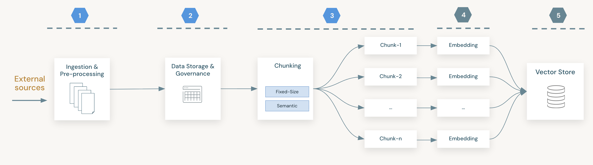
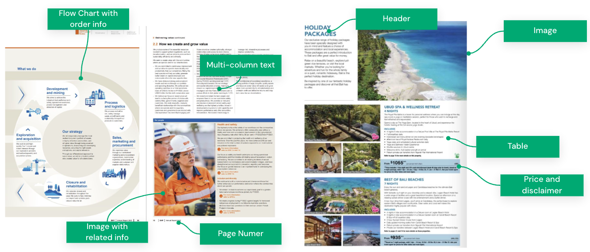
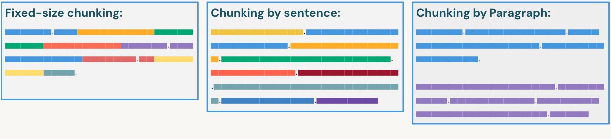
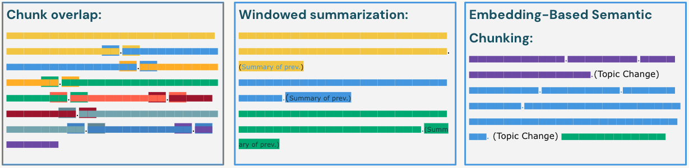

<div style="text-align: center; line-height: 0; padding-top: 9px;">
  
</div>

# Document Parsing and Chunking

## Introduction

The effectiveness of a **Retrieval Augmented Generation (RAG)** application is fundamentally constrained by the quality of the data it retrieves. Before **embedding generation**, raw **unstructured data**—such as PDFs, HTML files, and images—must be ingested, stored, and transformed into a format that **Large Language Models (LLMs)** can interpret. This lesson focuses on the data preparation stage within the **Databricks Intelligence Platform**, specifically leveraging **Delta Lake** for storage and **Unity Catalog** for governance. We will examine the native **`ai_parse_document`** function for extracting structured text from binary files and explore critical strategies for **text chunking**, moving beyond basic **fixed-size splitting** to **context-aware methods**.

## Lesson Objectives

* Explain the role of Delta Lake and Unity Catalog Volumes in storing unstructured data for RAG.
* Describe the functionality of Databricks AI Functions, specifically `ai_parse_document`, and its v2.0 capabilities like figure description.
* Identify efficient ingestion patterns using Autoloader and Spark Declarative Pipelines (SDP).
* Compare and contrast fixed-size, recursive, and embedding-based semantic chunking strategies.
* Map standard tools and frameworks used for parsing and chunking on Databricks.

## A. Data Storage and Processing Architecture

In a RAG architecture, data storage must accommodate both raw source files and processed, structured text. **Delta Lake** acts as the unified data management layer, delivering ACID transactions and versioning for all data types. While Delta tables are optimized for structured data, RAG workflows typically begin with unstructured files such as PDFs.

**Unity Catalog Volumes** provide a governance layer for these non-tabular files. Volumes enable you to manage access to raw files using the same unified permission model applied to tables and models. By storing raw documents in Volumes and processed text in Delta Tables, you maintain complete lineage from the original file to the chunked text used for retrieval.

**Note:** Volumes store the "raw" files (Bronze), while Delta Tables store the "parsed and chunked" text (Silver/Gold).

Below is an outline of the data ingestion and processing workflow. In a typical use case—and in this module—we follow this workflow, focusing on the first three steps:

1. **Data ingestion and pre-processing:** Read files from a Unity Catalog Volume and parse them using an AI function.
1. **Data storage:** Store the parsed documents in Delta Lake and apply necessary governance controls. (Governance is not covered in detail in this module.)
1. **Chunking:** Split the data into chunks suitable for embedding generation.



*Figure 1. This diagram show 5 main steps of data ingestion, processing and embedding generation workflow.*

## B. Document Processing with AI Functions

Document processing is essential for building a high-quality knowledge base for retrieval agents, especially when documents serve as the primary knowledge source. Real-world documents often have complex structures—such. To address these challenges, we leverage advanced models like Large Language Models (LLMs) and OCR-enabled LLMs, which are specifically designed to interpret and extract information from diverse document formats. Databricks provides native AI functions to streamline this process. In particular, the `ai_parse_document` function enables robust parsing of PDFs and images, extracting structured content and layout information directly from raw files.

### B1. Document Processing Challenges

Parsing real-world documents is complex because they are rarely just plain text. Documents often contain a mix of **images**, **multi-column layouts**, **tables**, **figures**, **headers**, **sub-headers**, and **page numbers**. Properly extracting this information while maintaining its semantic meaning presents several challenges:

* **Hierarchical Information:** Charts and diagrams often convey hierarchical relationships that must be preserved.
* **Order Preservation:** In multi-column documents, reading order is critical; naive parsing can merge columns incorrectly.
* **Contextual Integrity:** Images (like charts or product photos) must be kept associated with their relevant text descriptions.



*Figure 2. This image shows an example page layout which has complex page layout*

### B2. LLMs and OCR for Parsing

To address these challenges, modern approaches leverage **Large Language Models (LLMs)** and **OCR (Optical Character Recognition)** models. Unlike traditional text parsers, these models can "see" the document layout. OCR models can identify text within images, while multimodal LLMs can interpret the spatial arrangement of elements, understanding that a caption belongs to the image above it or that a table spans multiple pages.

### B3. Using `ai_parse_document`

Databricks simplifies this process with **AI Functions**, which allow developers to apply these advanced AI models directly to their data using simple SQL or Python function calls. This eliminates the need to manage separate model inference infrastructure. These functions run serverless, scale automatically to handle millions of rows, and operate directly on governed data within Unity Catalog.

The **`ai_parse_document`** function is the leading Databricks tool for this task. It invokes state-of-the-art generative AI models to extract structured content from unstructured documents (like PDFs and images) and returns the result as a structured JSON object (VARIANT type).

**Key Capabilities (Schema v2.0):**

* **Layout Awareness:** Separates document content from layout information.
* **Figure Descriptions:** Can automatically generate text descriptions for charts and images found within PDFs, making visual data accessible to the LLM.
* **Bounding Boxes:** Returns coordinates (bbox) for text elements, useful for highlighting sources in a UI.

**Example implementation:**

```sql
-- Extracts document layout and content from binary PDF data
SELECT ai_parse_document(content) as parsed_document
FROM read_files(
  '/Volumes/path/to/pdfs/',
  format => 'binaryFile'
)
```

## C. Data Cleaning and Transformation

After parsing a document, we need to clean the parsed content and transform it to a format that meets our goals.

### C1. Noise Reduction

Before text can be chunked, it requires cleaning to remove artifacts that degrade retrieval quality. Raw extraction often includes headers, footers, and page numbers that can interrupt the semantic flow of the text. Cleaning logic should be applied to the output of the parsing stage. For HTML data, while excessive formatting tags can confuse models, `ai_parse_document` can intelligently extract tables in HTML format, preserving their structure which is vital for parsing web pages and ensuring tabular data remains interpretable.

### C2. Metadata Injection

Effective RAG systems rely on metadata to filter search results *before* vector similarity search. During transformation, extracting and associating metadata—such as document titles, author names, or creation dates—is critical. If this metadata is not in the file properties, functions like **ai_extract** can be used to identify and pull structured fields (like "Invoice Date" or "Contract Type") from the unstructured text.

## D. Chunking Strategies

Chunking is the process of dividing long documents into smaller, manageable segments. This step is essential because embedding models have context window limits, and retrieving precise information requires granular search results.

Another important consideration is the relationship between context size and language model performance. The "Lost in the Middle" phenomenon occurs when LLMs overlook information buried deep within large context windows. As a result, creating smaller, relevant chunks is preferred to ensure critical details are not missed.

The key question is how best to chunk documents. There are several chunking methods, and in this section, we will explore the most common and effective approaches.

**Tip**: Check out [ChunkViz](https://chunkviz.up.railway.app/) to visualize chunking based on chunk size and splitter.

### D1. Fixed-Size vs. Recursive Chunking

* **Fixed-Size Chunking (Legacy/Baseline):** Divides text based on a hard character or token count (e.g., 500 tokens). It is computationally cheap but often splits sentences or paragraphs in half, destroying context.

* **Semantic Chunking (Recommended Standard):** Unlike arbitrary character splitting, this approach divides text based on meaningful linguistic boundaries such as **sentences**, **paragraphs**, or **document sections**. By respecting the document's logical structure, it preserves the semantic integrity of the information. Furthermore, semantic chunking often involves injecting relevant **metadata**, **tags**, and **titles** directly into the chunk, ensuring that even small text segments retain their broader context during retrieval.



*Figure 3. A visual representation of fixed-size chunking and semantic chunking.*

### D2. Advanced Chunking Strategies

To maximize retrieval performance and ensure semantic coherence, more sophisticated strategies are required to handle complex documents and preserve context across boundaries.

* **Chunk Overlap:** This technique defines the amount of overlap between consecutive chunks (e.g., 10-20%). By repeating a small portion of text at the beginning of the next chunk, it ensures that no contextual information is lost between them, preventing sentences or ideas from being cut off abruptly.

* **Embedding-Based Semantic Chunking:** This is a more advanced method that uses an embedding model to determine breakpoints. It calculates the semantic similarity between sequential sentences and only "breaks" a chunk when the topic significantly changes (i.e., when similarity drops below a threshold). This ensures that each chunk represents a distinct, coherent concept.

* **Windowed Summarization:** This is a 'context-enriching' chunking method where each chunk includes a 'windowed summary' of the previous few chunks. Instead of just seeing the current text, the model receives a summary of what came before, providing broader context without the cost of embedding the entire history.



*Figure 4. A visual representation of advanced chunking methods. Each color represents a chunk.*

### D3. Embedding Model Considerations

While embedding models are covered in detail in a later module, their technical constraints must be considered *now* during the chunking phase.

* **Context Window Limits:** Every embedding model has a maximum token limit (e.g., 512, 8192 tokens). If a text chunk exceeds this limit, the model will simply **truncate** the text, ignoring any content beyond the limit. This results in incomplete vector representations and lost data. Therefore, your maximum chunk size must always be safely below the embedding model's context window limit.

* **Granularity vs. Context:** A larger context window allows for bigger chunks, capturing more context but potentially diluting specific details. Smaller windows force smaller chunks, which are more precise but may lack surrounding context. The choice of chunk size is a direct trade-off that must align with the capabilities of the specific embedding model you intend to use downstream.

## E. Tools and Frameworks for Chunking

Document processing on Databricks combines native AI functions with leading open source libraries, such as LangChain, to create a robust multi-step pipeline. This workflow transforms raw files into embeddable text through sequential parsing and chunking.

1. **Parsing (Extraction):** The initial step is to parse the raw file and extract clean text along with layout information.
   * **`ai_parse_document` (Native):** This recommended tool efficiently processes standard documents (PDFs, images), performing OCR and layout analysis serverlessly. It returns structured text that is ready for downstream tasks.
1. **Chunking (Splitting):** After extraction, the text must be divided into smaller, manageable chunks.
   * **LangChain:** Libraries like LangChain provide advanced splitting logic (e.g., `RecursiveCharacterTextSplitter`) for the parsed text. LangChain's suite of text splitters supports diverse formats and strategies, making it the industry standard for chunking.
   * **Custom Functions:** Developers may also implement custom Python User Defined Functions (UDFs) to apply specialized splitting logic—such as dividing text by specific Markdown headers—on the output from `ai_parse_document`.

## F. Summary

Preparing data for RAG on Databricks involves a reliable pipeline of ingestion, parsing, and transformation. Raw files are first ingested into Unity Catalog Volumes. Then, they are parsed using the native **`ai_parse_document`** function, which leverages LLMs and OCR to extract clean text and layout information from complex documents like PDFs. Finally, this text is strategically chunked—using advanced methods like **Recursive Character Splitting** or **Embedding-Based Semantic Chunking**—to ensure that retrieval systems can access precise, context-rich information while respecting embedding model constraints.

**Key Takeaways:**

1. **Unified Governance:** Store raw files in Unity Catalog Volumes and processed chunks in Delta Tables to maintain full data lineage and security.
2. **Sequential Processing:** Document preparation is a two-step process: first, use **`ai_parse_document`** for robust extraction (OCR/Layout), and second, use libraries like LangChain for logical splitting.
3. **Advanced Chunking:** Move beyond simple fixed-size splitting. Adopt **semantic strategies**, **overlap**, or **Parent Document Retrieval** to prevent context loss and improve retrieval accuracy.

---

&copy; 2026 Databricks, Inc. All rights reserved. Apache, Apache Spark, Spark, the Spark Logo, Apache Iceberg, Iceberg, and the Apache Iceberg logo are trademarks of the <a href="https://www.apache.org/" target="_blank">Apache Software Foundation</a>.<br/><br/><a href="https://databricks.com/privacy-policy" target="_blank">Privacy Policy</a> | <a href="https://databricks.com/terms-of-use" target="_blank">Terms of Use</a> | <a href="https://help.databricks.com/" target="_blank">Support</a>
