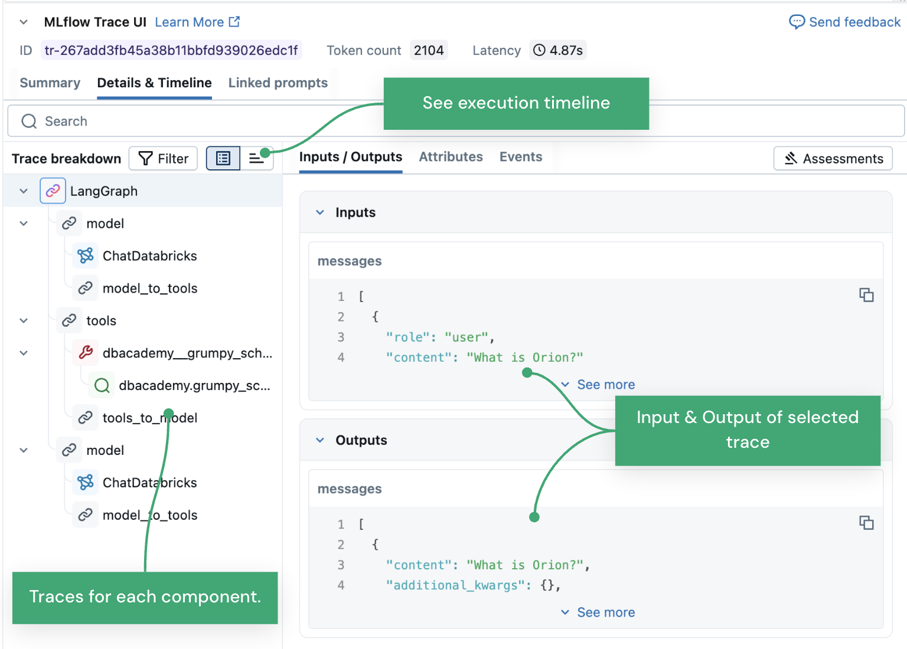
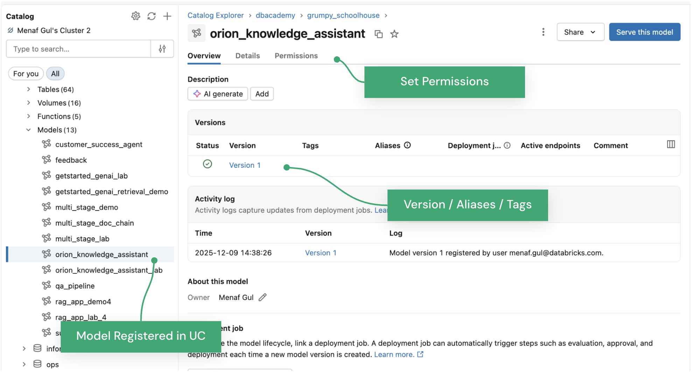

  

# MLflow and Agent Development

## Introduction

Building a retrieval agent differs from training a standard model; it involves orchestrating a dynamic interplay among user queries, embedding models, vector databases, and large language models. This lesson explores how **MLflow 3.0+** provides the necessary infrastructure to develop, debug, and govern these agents. We will move beyond simple logging to explore deep traceability of retrieval steps and the governance of agent artifacts using Databricks Unity Catalog.

## Lesson Objectives

* Identify the core **Components of MLflow** and their specific roles in agent development.
* Configure **Experiments** to track variations in prompts and retriever settings.
* Differentiate between standard model flavors and **GenAI-specific flavors** (LangChain, PyFunc).
* Utilize **MLflow Tracing** to diagnose specific retrieval failures (e.g., empty search results, high latency).
* Register and govern retrieval agents using the **Unity Catalog Model Registry**.

## A. Foundations of MLflow for Agents

MLflow is an open source platform designed to manage the end-to-end machine learning lifecycle. In the context of agent development, it acts as the central system of record for every configuration, code version, and execution trace.

To understand its value, consider the "No MLflow" scenario: developers often rely on scattered print() statements or basic logs to debug complex chains. This approach fails when you need to understand *why* a specific query failed—was it a timeout in the Vector Search, a malformed query to the embedding model, or a reasoning error? Without a structured tracking system, correlating these intermediate failures with specific configuration changes becomes nearly impossible.

**With MLflow**, every aspect of the agent's behavior—from the retrieval parameters to the final generation—is systematically recorded. This allows you to answer the question, "Which exact configuration produced this high-quality response?" with certainty.

### A1. Components of MLflow

Before diving into specific workflows, it is essential to understand the platform's architectural pillars. MLflow is not a single tool but a suite of integrated components that handle different stages of the agent lifecycle, from the first line of code to final production governance.

* **MLflow Tracking:** The API and UI for logging parameters, code versions, metrics, and output files. For retrieval agents, this includes tracking system prompts and retriever configurations.
* **MLflow Tracing:** A dedicated observability feature that captures the hierarchical execution flow of an agent, essential for debugging the specific retrieval tool calls.
* **MLflow Models:** A standard format for packaging models that can be used in various downstream tools (like real-time serving) regardless of the library used to build them.
* **MLflow Model Registry:** A centralized repository to collaborate on model lifecycle management, versioning, and stage transitions (e.g., Staging to Production).

### A2. Experiments and Runs

Once you understand the components, the first step in any development cycle is organizing your iterations. When testing a retrieval agent, you might try twenty different system prompts or chunking strategies, and without a structure, this quickly becomes chaotic.

An **Experiment** acts as the primary logical container for a specific project, such as "Customer Support Retrieval Agent." Within an experiment, individual **Runs** capture the specific state of the agent at a point in time. MLflow solves the reproducibility problem by logging the **configuration of the reasoning engine** for every run:

* **System Prompts:** The specific instructions defining the agent's persona (e.g., "You are a helpful assistant who only answers based on retrieved context").
* **Model Configuration:** Parameters such as temperature and `max_tokens`.
* **Retriever Settings:** Critical parameters like the number of chunks to retrieve (k) or the filtering threshold for vector similarity.

Developers use `mlflow.set_experiment()` to define the workspace location where these runs are stored, organizing iterations of the retrieval logic.

### A3. Model Flavors and Wrappers

After logging your experiments and finding a winning configuration, you need a way to package that agent for deployment. You cannot simply save a Python script and expect it to work in production without its dependencies, environment, and specific loading logic.

A **Model Flavor** is an integration that enables MLflow to save, load, and serve a model without requiring the user to manually handle these dependencies.

* **Native GenAI Flavors:** MLflow includes native support for libraries like **LangChain** (mlflow.langchain) and **OpenAI**. These flavors automatically handle the serialization of the retrieval chain and its components.
* **PyFunc Flavor:** For production-grade retrieval agents, you often need custom logic—such as a specific re-ranking step or dynamic filter application—that native flavors might not cover. The python function (PyFunc) flavor allows you to wrap arbitrary Python code as a model, provided it exposes a predict() method.

**Note:** When using PyFunc for retrieval agents, ensure that your custom retriever code and any necessary configuration files are included in the logged artifact.

## B. Observability and Tracing

Now that we have a packaged agent, we face a new challenge: **understanding why it behaves the way it does**. Unlike a traditional model, where accuracy is simply checked, a retrieval agent is a "black box" of interactions between the user, the vector database, and the LLM, making standard debugging methods ineffective.

### B1. The Need for Tracing

If a user asks, "What is the policy on remote work?" and the agent answers, "I don't know," a simple text log won't tell you why. Did the retrieval tool fail to find documents? Was the retrieval slow and timed out? Or did the LLM ignore the retrieved context? **MLflow Tracing** provides high-fidelity visibility into this execution graph by recording the inputs and outputs of every step in the chain.

### B2. Traces and Spans

*Figure 1. This diagram shows the mlflow's tracing UI.*

MLflow Tracing visualizes the execution flow using **Traces** and **Spans**.

* **Trace:** Represents the entire request lifecycle, from the user's initial question to the final answer.
* **Span:** Represents an individual unit of work. For a retrieval agent, you will typically see specific spans for "query_embedding", "retrieval_tool", and "context_generation".

Tracing can be enabled via **Auto-logging** for supported libraries (e.g., `mlflow.langchain.autolog()`) or via **Manual Instrumentation** using the `@mlflow.trace` decorator for custom retrieval functions.

### B3. Diagnosing Retrieval Failures

The primary value of tracing lies in debugging the specific failure modes of the retrieval tool. Tracing allows developers to pinpoint issues that are invisible in standard logs:

1. **Empty or Irrelevant Retrieval:** By inspecting the output of the **Retriever Span**, you can see exactly what chunks were returned from the vector database. If the span output is empty or contains irrelevant text despite a good query, you know the issue lies with the embedding model or the chunking strategy, not the LLM.
2. **Latency in Vector Search:** Spans capture **Latency** (duration). If an agent is slow, the trace waterfall might reveal that the `vector_search` span took 4 seconds while the LLM generation took only 500ms. This directs optimization efforts toward the database query rather than the model.
3. **Hallucination despite Context:** If the trace shows that the Retriever Span returned the correct document, but the LLM Span output ignores it, you have identified a reasoning failure. This indicates a need to refine the system prompt to enforce strict adherence to the provided context.

## C. Governance with Unity Catalog

With a functioning, debugged agent, we face the final hurdle: production governance. You cannot let developers push code directly to production endpoints without validation, nor can you allow ungoverned access to the underlying data, making a robust registry system mandatory.

### C1. The Unity Catalog Model Registry

Agents deployed in enterprise environments require strict governance and oversight. **Unity Catalog (UC)** serves as the centralized registry for these assets. Unlike the legacy Workspace Model Registry, UC provides a three-level namespace (`catalog.schema.model`) that unifies access control across data and AI assets.

* **Access Control:** You can manage permissions (`SELECT`, `EXECUTE`) on the registered agent just as you would on the underlying Vector Search tables.
* **Lineage:** UC tracks which data tables (via Vector Search indexes) were used by the agent, providing end-to-end lineage from the raw documents to the deployed agent.

### C2. Logging and Registering Agents

The workflow to govern an agent involves logging the model with a specific signature and then registering it.

1. **Define Model Signature:** Agents typically accept string inputs or lists of chat history. You must define this input/output schema using `mlflow.models.ModelSignature` to ensure the serving endpoint validates requests correctly.
2. **Log the Model:** Use `mlflow.langchain.log_model` (or the appropriate flavor). It is best practice to include an **Input Example**, which allows the UI to generate a functioning test widget.
3. **Register:** Once logged to an experiment, the model version is registered to Unity Catalog using:
   `mlflow.register_model("runs:/<run_id>/model", "catalog.schema.retrieval_agent")`

**Note:** The **Retrieval Tool** itself (if defined as a Unity Catalog Function) should also be governed within the same catalog structure to maintain consistent security boundaries.

*Figure 2. This diagram shows UC model registery interface.*

*Reference:* [Manage models in Unity Catalog Documentation](https://docs.databricks.com/aws/en/machine-learning/manage-model-lifecycle)

## D. Summary

This lesson outlined the adaptation of MLflow for retrieval-centric workflows. We defined the core **Components of MLflow** and how **Experiments** capture the specific configurations of retrievers and prompts. We explored **MLflow Tracing** as a critical tool for distinguishing between retrieval failures (resulting in poor search results) and reasoning failures (such as hallucinations). Finally, we covered the role of **Unity Catalog** in providing a governed registry for versioning these agents.

**Key Takeaways:**

1. **Tracing is essential for Retrieval:** You cannot effectively debug why an agent said "I don't know" without seeing the intermediate retrieval span outputs.
2. **PyFunc for Custom Logic:** Complex retrieval strategies often require the pyfunc wrapper to encapsulate custom re-ranking or filtering logic.
3. **Governance via Unity Catalog:** Agents should be registered in Unity Catalog (catalog.schema.model) to ensure lineage back to the source documents and secure access control.

---

&copy; 2026 Databricks, Inc. All rights reserved. Apache, Apache Spark, Spark, the Spark Logo, Apache Iceberg, Iceberg, and the Apache Iceberg logo are trademarks of the <a href="https://www.apache.org/" target="_blank">Apache Software Foundation</a>.  <a href="https://databricks.com/privacy-policy" target="_blank">Privacy Policy</a> | <a href="https://databricks.com/terms-of-use" target="_blank">Terms of Use</a> | <a href="https://help.databricks.com/" target="_blank">Support</a>
