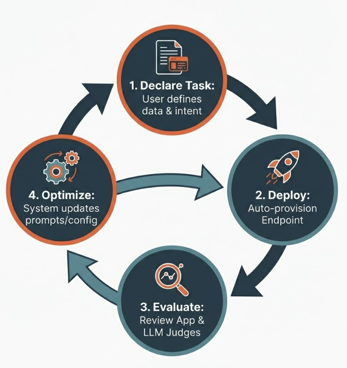
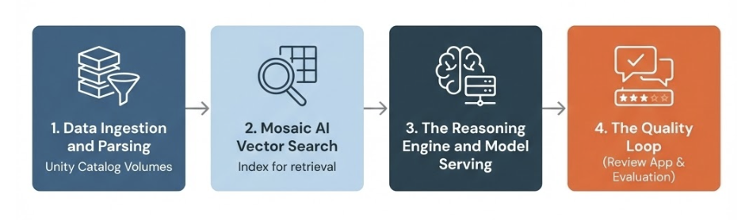

  

# Knowledge Assistant with Agent Bricks

## Introduction

This lecture introduces **Agent Bricks**, a declarative framework within Databricks Mosaic AI that simplifies the creation of production-ready AI agents. We will specifically focus on the **Knowledge Assistant**, a specialized pattern for building expert conversational agents grounded in enterprise documentation. You will learn how Agent Bricks shifts the development paradigm from manual tuning to outcome-oriented declaration, leveraging automated optimization loops to enhance efficiency. Finally, we will explore the underlying architecture that powers these agents, ensuring they are robust, scalable, and governed.

## Lesson Objectives

By the end of this lesson, you will be able to:

* **Define** the core value proposition of Agent Bricks compared to traditional manual development methods.
* **Identify** the primary use cases for Agent Bricks, including Information Extraction and Custom LLMs.
* **Explain** the architectural components of a Knowledge Assistant, such as parsing, Vector Search, and model serving.
* **Describe** the "Quality Loop" and how Agent Learning from Human Feedback (ALHF) optimizes agent performance.

## A. What is Agent Bricks?

**Agent Bricks** is a **declarative** framework within the Databricks Mosaic AI designed to accelerate the creation, deployment, and optimization of production-quality AI agents. Unlike traditional "do-it-yourself" (DIY) approaches, where engineers must manually select models, configure chunking strategies, and hand-tune prompts, Agent Bricks automates these configuration decisions based on the provided data and task.

### A1. The Challenge of Production AI

Moving Generative AI from a proof-of-concept (PoC) to production faces three primary friction points:

1. **Optimization Complexity:** An AI system has numerous "knobs," including the choice of LLM (e.g., Llama 4 vs. GPT-4o), retrieval strategies (such as chunk size and embedding models), and prompt engineering techniques. Finding the optimal combination for a specific enterprise dataset is time-consuming.
2. **Evaluation Difficulty:** Determining if an agent is "good enough" for production requires rigorous testing. Teams often lack labeled "golden datasets" or verifiable metrics, relying instead on subjective "vibe checks."
3. **Cost vs. Quality Trade-off:** Achieving high quality often requires expensive, large models. Reducing costs usually degrades performance. Teams struggle to find the optimal balance where quality is maximized for the lowest possible cost.

### A2. The Agent Bricks Solution

Agent Bricks solves these challenges by treating the agent definition as **declarative**. You provide the data and select the task, and the Agent Bricks engine iteratively optimizes the system.

The core mechanism driving this is **Agent Learning from Human Feedback (ALHF)**. The system:

1. **Deploys** a baseline agent immediately.
2. **Collects** feedback via a Review App (thumbs up/down, corrected answers).
3. **Synthesizes** this feedback to automatically generate evaluation benchmarks and optimize the underlying prompt and configuration, without requiring manual code changes.

*Figure 1: The Agent Bricks optimization cycle. The system transitions from Task Declaration to Deployment, then utilizes Feedback to drive Optimization, forming a continuous loop of improvement.*

## B. Agent Bricks Use Cases

Agent Bricks provides pre-configured architectures ("bricks") for common enterprise patterns. Each brick is specialized for a specific mode of interaction and data processing.

### B1. Knowledge Assistant

This is the focus of this lecture. **The Knowledge Assistant turns enterprise documentation into an expert conversational agent**.

* **Function:** It performs Retrieval Augmented Generation (RAG) over specified files. It handles parsing, chunking, embedding, and citation generation automatically.
* **Use Case:** An HR bot answering policy questions based on a handbook, or a technical support bot resolving tickets based on product manuals.

### B2. Information Extraction

This agent type converts unstructured documents (such as PDFs, images, and text files) into structured data.

* **Function:** It extracts specific fields defined by a JSON schema.
* **Use Case:** Converting a repository of invoices into a structured Delta table containing "Vendor Name," "Total Amount," and "Date," or extracting clauses from legal contracts.

### B3. Multi-Agent Supervisor

This advanced pattern orchestrates multiple agents and tools to solve complex, multi-step problems.

* **Function:** A "supervisor" agent routes user queries to the correct sub-agent or tool (e.g., a Unity Catalog Function).
* **Use Case:** A customer support system where the supervisor routes billing questions to a **Genie** space (structured data) and technical troubleshooting questions to a **Knowledge Assistant** (unstructured data).

### B4. Custom LLM

This agent creates a specialized LLM endpoint tailored to specific enterprise guidelines and tasks.

* **Function:** It optimizes a model to adhere to specific tone, formatting, or compliance rules.
* **Use Case:** A marketing generator that writes social media posts adhering strictly to a brand's style guide, or a summarization tool that outputs specific formats for executive reports.

## C. Declarative vs. Code-First Methods

When building AI agents on Databricks, developers typically choose between two primary levels of abstraction: Code-First and Declarative.

### C1. Code-First (Mosaic AI Agent Framework)

This method offers maximum control but requires more effort. Developers write the core agent logic in code (using Python libraries like LangChain, LlamaIndex, or OpenAI SDK) and use the **Mosaic AI Agent Framework** for scaffolding, tracing, and governance.

* **Workflow:** The developer manually writes the retrieval logic, defines the prompt templates, selects the embedding model, and manages the vector search index synchronization. They use the Agent Framework to log traces to MLflow and deploy the agent as a Model Serving endpoint.
* **Pros:** Infinite customizability. You can implement novel reasoning loops or highly specific tool usage.
* **Cons:** The developer owns the technical debt. Optimization (chunking, prompting) is manual and if the retrieval strategy needs changing (e.g., changing chunk sizes), the code must be rewritten and redeployed.

### C2. Declarative (Agent Bricks)

This is the "outcome-oriented" approach. The developer declares *what* the agent should do, not *how* to do it.

* **Workflow:** The developer selects "Knowledge Assistant," points it to a Unity Catalog Volume containing PDFs, and provides a text description of the persona. Agent Bricks handles the parsing, indexing, and prompt engineering.
* **Pros:** Fastest time-to-value. The system creates synthetic data to test itself and auto-optimizes based on feedback.
* **Cons:** Less granular control over the low-level execution logic compared to pure code.

## D. Knowledge Assistant Components

A Knowledge Assistant built with Agent Bricks is not a "black box"; it is a composed system of native Databricks architecture. Understanding these components is critical for debugging and governance.

*Figure 2: The Agent Bricks knowledge assistant components. These components work behind the scenes and user don't need to manage them.*

### D1. Data Ingestion and Parsing

The foundation of the Knowledge Assistant is data stored in **Unity Catalog Volumes**.

* **Source:** The user selects a Volume containing files (PDF, DOCX, HTML).
* **Parsing:** The system utilizes **ai\_parse\_document**, a Mosaic AI function designed to extract text, tables, and images from complex documents. This ensures that visual elements in a PDF (like a chart) are converted into context the LLM can understand.

### D2. Mosaic AI Vector Search

Once parsed, the data must be indexed for retrieval.

* **Managed Embeddings:** Agent Bricks automatically selects an embedding model (e.g., GTE) and provisions a **Mosaic AI Vector Search** index.
* **Synchronization:** The index is fully managed. When new files are added to the source Volume, the Vector Search index automatically updates, ensuring the agent always has the latest knowledge without manual re-indexing.

### D3. The Reasoning Engine and Model Serving

The agent logic is hosted on **Model Serving**.

* **Inference:** When a user asks a question, the system converts the query to vectors, retrieves relevant chunks from Vector Search, and passes them to the LLM.
* **Citation:** Crucially, the Knowledge Assistant is architected to provide citations. It maps the answer back to the specific source file in the Unity Catalog Volume, allowing users to verify accuracy.

### D4. The Quality Loop (Review App & Evaluation)

This is the differentiator for Agent Bricks.

* **Review App:** A built-in UI where stakeholders (SMEs) can chat with the agent and provide feedback (thumbs up/down/edit).
* **LLM Judges:** The system uses **Mosaic AI Agent Evaluation** to run "LLM Judges" against the interaction traces. These judges assess metrics like "faithfulness" (did the model hallucinate?) and "correctness."
* **Optimization:** Agent Bricks uses the collected feedback to propose updates to the system instructions or configuration to improve performance metrics.

## E. Summary

The **Knowledge Assistant with Agent Bricks** represents a shift from manually engineering AI components to managing AI outcomes. By leveraging a declarative approach, teams can deploy RAG (Retrieval Augmented Generation) systems that are grounded in their enterprise data within minutes.

**Key Takeaways:**

1. **Optimization over Configuration:** Agent Bricks automates the selection of models and retrieval parameters to strike a balance between cost and quality.
2. **Integrated Architecture:** It orchestrates Unity Catalog Volumes, ai\_parse\_document, and Vector Search automatically.
3. **Feedback-Driven:** The system continually improves over time through the use of the Review App and Agent Learning from Human Feedback (ALHF), converting subject matter expert feedback into system enhancements.

---

&copy; 2026 Databricks, Inc. All rights reserved. Apache, Apache Spark, Spark, the Spark Logo, Apache Iceberg, Iceberg, and the Apache Iceberg logo are trademarks of the <a href="https://www.apache.org/" target="_blank">Apache Software Foundation</a>.  <a href="https://databricks.com/privacy-policy" target="_blank">Privacy Policy</a> | <a href="https://databricks.com/terms-of-use" target="_blank">Terms of Use</a> | <a href="https://help.databricks.com/" target="_blank">Support</a>
