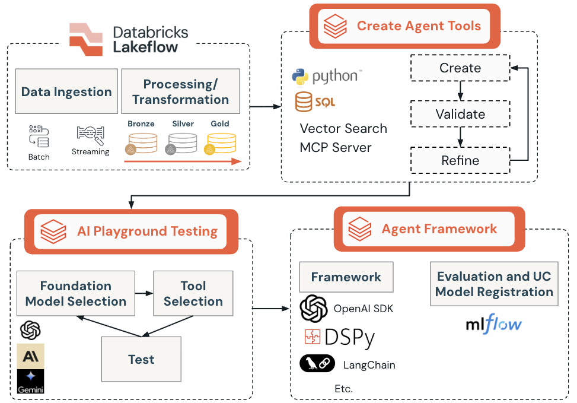
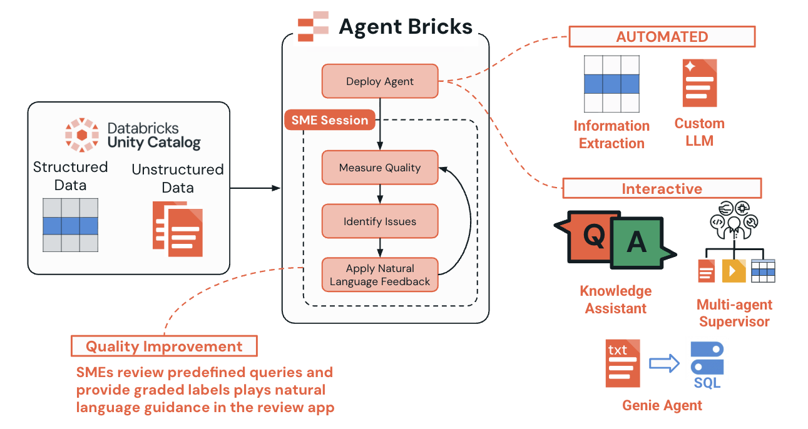

  

# Lecture - Foundations of AI Agents and Tools on Databricks

## Overview

This lecture introduces the fundamental concepts of AI agents and tools within the Databricks platform. Modern AI applications require agents that can interact with data, perform analytical tasks, and make informed decisions based on available information. By understanding these foundational concepts, you'll be prepared to build robust, scalable AI solutions that combine governance, security, and analytical power.

AI agents represent a revolutionary shift from traditional AI systems that simply provide information based on user prompts. Instead, agents use available tools to help them make more accurate and informed decisions, acting autonomously within their environment to achieve user-defined goals.

### Learning Objectives

_By the end of this lecture, you will be able to:_

- Define what AI agents are and understand their core components and capabilities
- Explain the role of tools in AI agent architectures and how they extend agent functionality
- Identify the benefits of using Unity Catalog for agent tool governance and management

## A. Understanding AI Agents

### A1. What Are AI Agents?

An **AI agent** is an intelligent software system that can perceive its environment, make decisions, and take actions to achieve specific goals. Unlike traditional AI systems that require continuous inputs from users, AI agents are autonomous systems that can:

- **Reason** about complex problems and situations
- **Plan** sequences of actions to achieve objectives
- **Adapt** their behavior based on new information
- **Interact** with external systems and data sources
- **Learn** from experience to improve future performance

What makes AI agents exciting is their **adaptability**. They use tools that dynamically pull up-to-date datasets to inform decisions and processes, making them ideal for complex and unpredictable tasks. While humans set the goals, AI agents determine the best way to achieve those goals.

In the context of data analytics and business intelligence, AI agents serve as intelligent intermediaries between users and data systems, capable of understanding natural language queries and executing complex analytical tasks.

### A2. Evolution of AI Agents

AI agents have evolved significantly since their inception:

- **1960s - Rule-Based Systems**
    - Basic chatbots with predetermined logic trees
    - Rigid, rule-based programming
    - Limited to simple, scripted responses

- **1990s - Statistical Learning**
    - More autonomous systems processing information
    - Simple decision-making capabilities
    - Foundation for consumer-grade AI devices

- **2000s - Machine Learning Integration**
    - Consumer devices like robot vacuums and digital assistants (Siri, Alexa)
    - Statistical machine learning models and neural networks
    - Enhanced decision-making and analysis capabilities

- **2020s - Large Language Models**
    - Breakthrough with deep reinforcement learning and transformer-based large language models (LLMs)
    - Multimodal interfaces and advanced reasoning
    - Dynamic interaction with complex environments
    - Tool-calling capabilities for enhanced functionality

### A3. Key Principles of AI Agents

AI agents operate on three fundamental principles that distinguish them from traditional software:

#### **Perception**
The first step for agents to understand the context in which they're operating. For language models, this includes:
- User inputs and queries via text, photos, or audio
- Environmental data from sensors or APIs
- Historical context and conversation memory

#### **Decision-Making**
The agent processes collected information through algorithms and determines proper actions according to user goals:
- Analyzing requirements and constraints
- Determining necessary steps and tool usage
- Planning optimal execution sequences

#### **Action**
Finally, an agent takes concrete steps to achieve objectives:
- Executing database queries and API calls
- Processing and transforming data
- Generating reports and recommendations
- Making decisions that affect real-world outcomes

### A4. Core Components of AI Agents
Modern AI agents typically consist of several key components working together:

1. **Large Language Model (LLM) Brain**
The central reasoning engine that processes natural language, understands context, and makes decisions about what actions to take.
2. **Memory System**
Stores conversation history, context, and learned information to maintain coherent interactions over time.
3. **Planning Module**
Breaks down complex requests into smaller, manageable tasks and determines the optimal sequence of actions.
4. **Tool Interface**
Connects the agent to external systems, databases, APIs, and functions that extend its capabilities beyond text generation.
5. **Execution Engine**
Manages the actual execution of planned actions and handles responses from external tools and systems.

### A5. Types of AI Agents by Complexity

AI agents differ based on their complexity and application. Understanding these types helps in selecting the right approach for specific use cases:
1. **Simple Reflex Agents**
    - Make decisions based on current conditions only
    - Example: Robot vacuum that cleans only when it senses dirt
    - No consideration of history or future implications
2. **Model-Based Reflex Agents**
    - Account for current state and use world models to guide actions
    - Example: Smart thermostat adjusting based on time, weather, and preferences
    - More sophisticated than simple reflex agents
3. **Goal-Based Agents**
    - Plan specific strategies to achieve desired goals
    - Develop action sequences and evaluate progress
    - Example: Navigation systems like Google Maps considering traffic and routes
4. **Utility-Based Agents**
    - Evaluate multiple ways to achieve goals for optimal efficiency
    - Consider risk-reward models and optimization criteria
    - Example: AI trading bots adjusting investment strategies
5. **Learning Agents**
    - Learn from past actions and adapt to future situations
    - Analyze performance and seek efficiency improvements
    - Example: Recommendation systems that improve based on user behavior

### A6. Can All LLMs Use Tools?
No, not all LLMs have the tool-calling capability. On Databricks, tool usage by LLMs is enabled through specific frameworks and integrations, such as Databricks Assistant or custom agent frameworks that allow LLMs to interact with external systems, databases, or APIs. This capability is not inherent to all LLMs; it requires additional engineering, orchestration, and security controls to ensure safe and effective tool usage. For example, Databricks Assistant is designed to use tools to answer questions and perform actions within the Databricks environment, but this is a feature of the platform, not a universal capability of all LLMs.

> For a complete list of Foundation Model APIs that can perform tool-calling, please read more [here](https://docs.databricks.com/aws/en/machine-learning/model-serving/function-calling#supported-models).

## B. Understanding Agent Tools

### B1. What Are Agent Tools?

**Agent tools** are specialized functions or capabilities that extend an AI agent's ability to interact with external systems and perform specific tasks. Think of tools as the "hands" of an AI agent, while the LLM provides the "brain" for reasoning and decision-making, tools enable the agent to actually manipulate data, call APIs, perform calculations, and interact with the real world.

Tools transform agents from purely conversational systems into actionable, productive assistants. Some examples include:

- Execute database queries and retrieve specific information
- Perform complex calculations and statistical analysis
- Interact with external APIs and web services
- Process and transform data in various formats
- Generate reports, visualizations, and summaries
- Make real-time decisions based on current data

### B2. How Tools Differ from Traditional AI Components

It's important to understand how agent tools relate to other AI technologies. Here are examples to help distinguish between tools and machine learning models, chatbots, and traditional APIs:

#### **Tools vs. Machine Learning Models**
- **ML Models**: Provide intelligence (prediction, generation, reasoning) used by agents
- **Agent Tools**: Executable capabilities an agent can call to take action or retrieve information — some tools may call ML models, others may call APIs, databases, or run business logic
- **Example**: A sentiment model scores a customer message; the agent uses a tool (e.g., `escalate_ticket`) to act based on that score

#### **Tools vs. Chatbots**
- **Chatbots**: Provide conversational responses within a bounded scope (scripts, retrieval, predefined flows)
- **Agent Tools**: Allow an agent to go beyond responding — the agent can decide to execute actions (e.g., search a database, send an email, write to a record)
- **Key Point**: Chatbots converse; agents use tools to *do things* in the real world

#### **Tools vs. Traditional APIs**
- **Traditional APIs**: Require manual programming to choose and call functions
- **Agent Tools**: Can be dynamically selected and orchestrated by AI reasoning based on context and goals
- **Intelligence**: Tools expose metadata and descriptions so the agent understands *when* and *how* to use them

### B3. Tool Selection and Orchestration

One of the key capabilities of modern AI agents is **intelligent tool selection**. When presented with a user request, the agent must:

1. **Analyze the Request**: Understand what the user is trying to accomplish
2. **Identify Required Tools**: Determine which tools are needed to fulfill the request
3. **Plan Execution Order**: Decide the sequence in which tools should be called
4. **Execute and Coordinate**: Call tools with appropriate parameters and handle responses
5. **Synthesize Results**: Combine outputs from multiple tools into a coherent response
6. **Learn and Adapt**: Improve tool selection based on success patterns

This orchestration capability allows agents to handle complex, multi-step workflows automatically, making them ideal for scenarios requiring dynamic problem-solving approaches.

## C. Unity Catalog and Agent Tool Governance
It's important to understand the tooling ecosystem on Databricks, so you can decide which tool use case is best for you. Currently, there are three options for creating agent tools:
1. **Unity Catalog function tools**: This is the primary focus of this course. Your tools are defined as UC UDFs and are managed in UC as a central registry for your agent's tools. This allows for built-in security and compliance features while granting easier discoverability and reuse.
1. **Agent-code tools**: These are tools defined directly in an agent's code. This is best for calling REST APIs, running arbitrary code, or running low-latency tools. However, this approach lacks built-in governance and discoverability that UC brings to the table.
1. **Model Context Protocol (MCP) tools**: These are tools that follow the MCP standard for tool interoperability. Databricks-managed MCP servers are currently available and you can check the release status [here](https://docs.databricks.com/aws/en/generative-ai/mcp/managed-mcp).

### C1. Why Unity Catalog for Agent Tools?
Now that we have an understanding of what the basics of what makes an agent an agent, let's turn our attention to understanding how Databricks enables tool calling by first looking at where tools are stored and how they're governed on the platform via Unity Catalog.

**Unity Catalog** provides the foundation for agent tool management with enterprise-grade capabilities:

1. **Centralized Governance**
    - Unified object model and three-level namespace for data and AI assets, including functions, across all UC-enabled workspaces.
    - Built-in auditing and lineage, with system tables to simplify access and analysis.
    - Consistent metadata and discoverability via Catalog Explorer and search.
    - Governed tools: functions registered in UC can be used as agent tools, enabling reuse and control.
1. **Security and Access Control**
    - Fine-grained permissions (ANSI GRANTs), including EXECUTE on functions/tools.
    - Centralized identity integration (SCIM, account-level identities) for consistent access across workspaces.
    - Secure, isolated execution for Python UDFs; governed access to external connections and locations.
        - Python UDFs require Unity Catalog and either a serverless/pro SQL warehouse, or UC-enabled clusters.
    - Role-based hierarchical privileges aligned to catalogs → schemas → objects (tables, views, volumes, models, functions).
1. **Discoverability and Documentation**
    - Searchable catalog with rich metadata (function and parameter comments), lineage, and browse capabilities.
    - Recommended docstrings for functions (purpose, parameters, return value, examples, change log) to aid tool calling.
    - Platform support for AI-powered documentation to accelerate discovery for governed assets.
1. **Scalability and Performance**
    - UC‑governed tools run via Databricks compute; agent tool execution uses serverless generic compute (Spark Connect serverless). Some integrations can execute UC functions via SQL Warehouses (uc_function).
    - Scaling and concurrency controls on SQL Warehouses; autoscaling on clusters to match workload demand.
1. **External Tool Support**
    -  When connecting [external tools](https://docs.databricks.com/aws/en/generative-ai/agent-framework/external-connection-tools) (such as Slack, Google Calendar, or any API service) via Unity Catalog connections, the management of credentials and authentication is governed by Unity Catalog policies. This means you can ensure secure, auditable access and apply organization-wide governance for integrations with external services.

### C2. Tool Registration and Management

Unity Catalog provides multiple approaches for registering and managing SQL-based agent tools. For tracing tool usage with your agent, Databricks leverages its managed MLflow agent tooling features like automatic signature and tracing and ResponseAgent interface. This course will concentrate on the fundamentals of tool calling by keeping the tool logic simple and direct (e.g. we will not go into an agent's ability to perform [vector search](https://www.databricks.com/product/machine-learning/vector-search)) so you can focus on how to use the Databrick platform for developing agents.

#### **SQL-Based Registration**
Using `CREATE OR REPLACE FUNCTION` statements with comprehensive metadata that can be used with LLMs:
- Clear parameter definitions with types and descriptions
- Function-level documentation and usage guidance
- Deterministic behavior specifications
- Built-in validation and error handling

#### **Programmatic Registration**
Using the `DatabricksFunctionClient()` for automated tool management:
- Programmatic creation and updates
- Integration with CI/CD pipelines
- Batch operations and bulk management
- Automated testing and validation workflows

#### **Documentation Best Practices**
SQL functions should include rich metadata to help AI agents understand their purpose:
- Comprehensive function comments explaining business logic
- Parameter descriptions with expected data types and ranges
- Return value specifications and example outputs
- Usage examples and common patterns
- Mark functions `DETERMINISTIC` [where appropriate](https://docs.databricks.com/aws/en/sql/language-manual/sql-ref-syntax-ddl-create-sql-function#parameters)

Both approaches ensure that SQL functions are properly documented, versioned, and accessible to AI agents while maintaining governance and security standards.

MLflow is foundational for building, monitoring, and deploying agent-based applications on Databricks, providing robust tracing, versioning, evaluation, and production deployment, especially when working with agent tooling

### C3. Other Tools and Common Patterns
While we will focus on agent tools in UC, it's important to point out that there are other tools that exist outside those discussed in this course.

#### Model Context Protocol (MCP)
The main benefit of MCP is standardization. You can create a tool once and use it with any agent—whether it's one you've built or a third-party agent. Similarly, you can use tools developed by others, either from your team or from outside your organization.
> You can read more about MCP on Databricks [here](https://docs.databricks.com/aws/en/generative-ai/mcp/). You can also read the official MCP documentation [here](https://modelcontextprotocol.io/docs/getting-started/intro).
#### Mosaic AI Vector Search
Mosaic AI Vector Search is a vector search solution that is built into the Databricks Data Intelligence Platform and integrated with its governance and productivity tools. Vector search is a type of search optimized for retrieving embeddings.
> You can read more about vector search [here](https://docs.databricks.com/aws/en/vector-search/vector-search).
#### Common Tool Patterns
Below is a summary of some common tool patterns, as well as additional links for reading, that exist on Databricks today.
| Tool pattern| Description|
|-------------|------------|
| **[Structured data retrieval tools](https://docs.databricks.com/aws/en/generative-ai/agent-framework/structured-retrieval-tools)** | Query SQL tables, databases, and structured data sources.                                   |
| **[Unstructured data retrieval tools](https://docs.databricks.com/aws/en/generative-ai/agent-framework/unstructured-retrieval-tools)** | Search document collections and perform retrieval-augmented generation.                    |
| **[Code interpreter tools](https://docs.databricks.com/aws/en/generative-ai/agent-framework/code-interpreter-tools)**         | Allow agents to run Python code for calculations, data analysis, and dynamic processing.   |
| **[External connection tools](https://docs.databricks.com/aws/en/generative-ai/agent-framework/external-connection-tools)**      | Connect to external services and APIs such as Slack.                                        |
| **[AI Playground prototyping](https://docs.databricks.com/aws/en/generative-ai/agent-framework/ai-playground-agent)**      | Use the AI Playground to quickly add Unity Catalog tools to agents and prototype behavior. |

## Conclusion

You now have a comprehensive foundation in the concepts and principles underlying AI agents and UC function tools on Databricks. This lecture has covered the evolution of AI agents from simple rule-based systems to today's sophisticated, tool-enabled systems that are transforming industries worldwide.

Key takeaways from this lecture include:

- **AI agents** are autonomous systems that combine perception, decision-making, and action capabilities to solve complex problems
- **Agent tools** extend AI capabilities by providing interfaces to external systems, data sources, and specialized functions
- **Unity Catalog** provides the governance, security, and management framework needed for enterprise-grade agent tool deployment

Now that you have an understanding of what an agent is and how tools are a core component of agentic behavior, let's dive a little deeper into UC tools on Databricks.

## Next Steps
- Continue to the next demonstration for building SQL functions and testing them in the AI Playground.
- For more training on agents, please see our other course offerings in the [Databricks course catalog](https://www.databricks.com/training/catalog?search=agent).

---

&copy; 2026 Databricks, Inc. All rights reserved. Apache, Apache Spark, Spark, the Spark Logo, Apache Iceberg, Iceberg, and the Apache Iceberg logo are trademarks of the <a href="https://www.apache.org/" target="_blank">Apache Software Foundation</a>.  <a href="https://databricks.com/privacy-policy" target="_blank">Privacy Policy</a> | <a href="https://databricks.com/terms-of-use" target="_blank">Terms of Use</a> | <a href="https://help.databricks.com/" target="_blank">Support</a>
