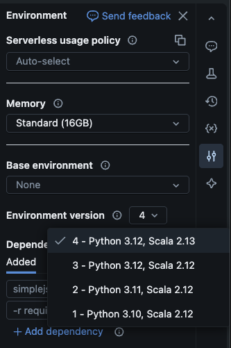
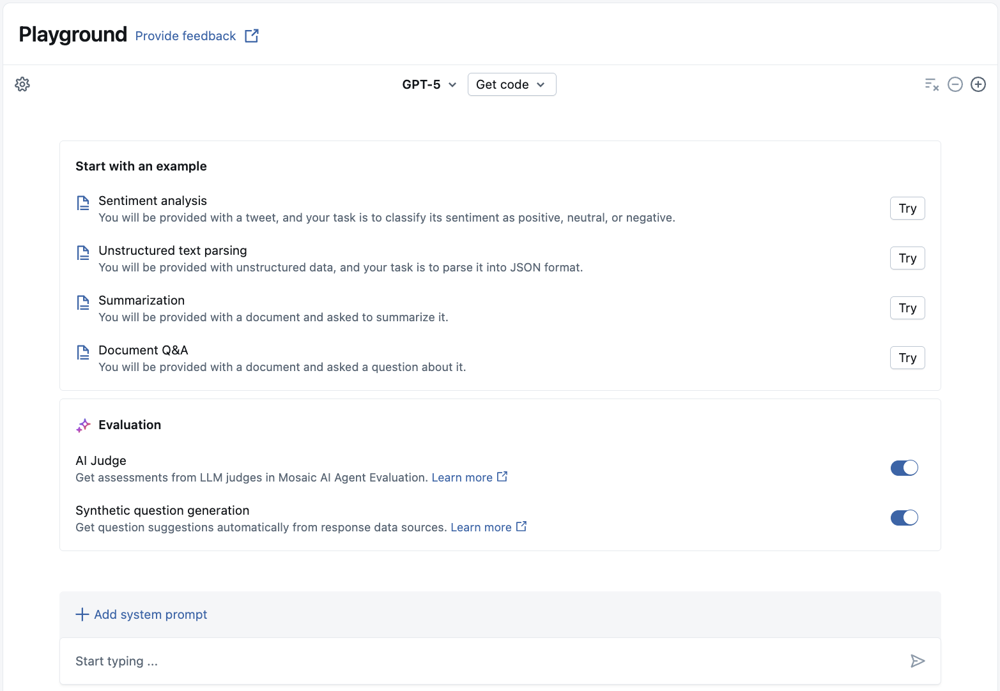
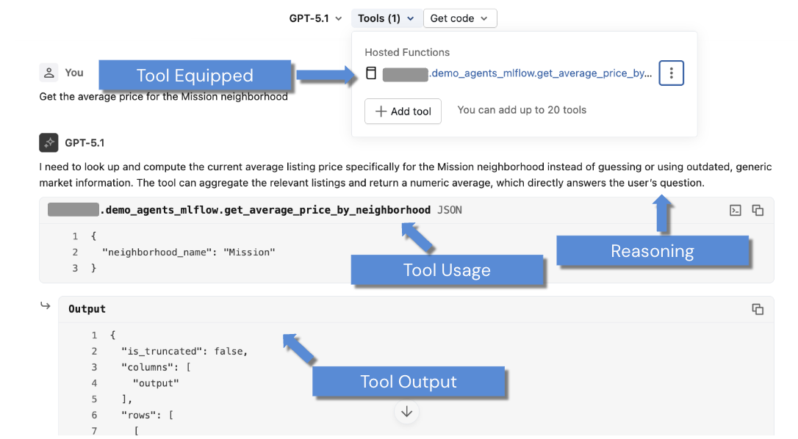
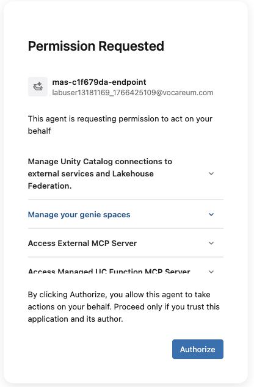
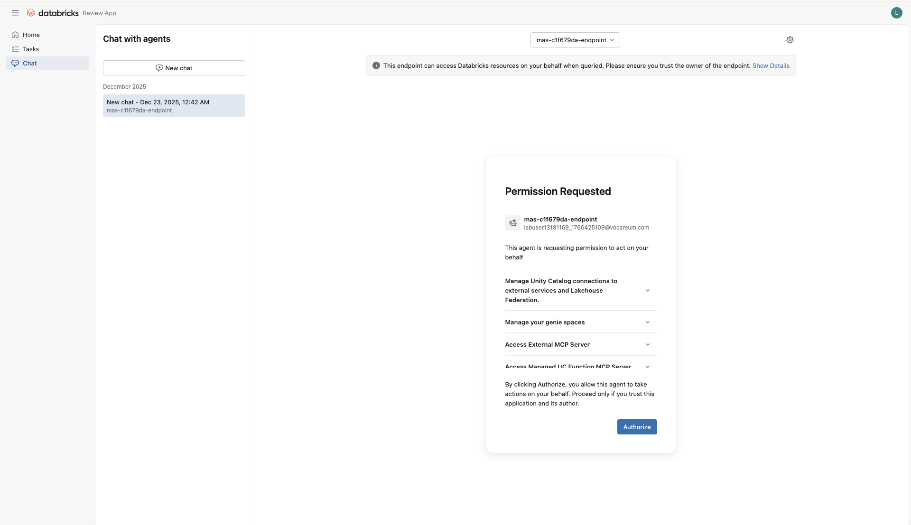
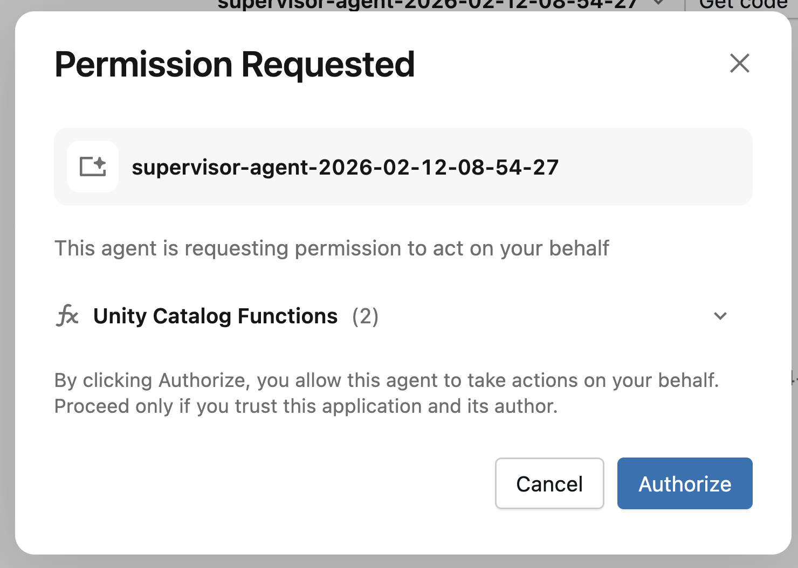

<div style="text-align: center; line-height: 0; padding-top: 9px;">
  
</div>

# Demo - Building UC Functions as Agent Tools with AI Playground

## Overview

This demonstration focuses on how to create Unity Catalog (UC) functions using both SQL and Python for AI agent use cases and test them using AI Playground.

Modern AI applications require agents that can interact with data and perform analytical tasks. By leveraging Unity Catalog's function registry with both SQL and Python functions, you can create robust, scalable solutions that combine the governance and security of UC with the analytical power of SQL and the computational flexibility of Python for AI agents.

This demo combines concepts from both SQL and Python function creation, demonstrating how to build a comprehensive toolkit that leverages the strengths of each approach within a single agent workflow.

## Learning Objectives
_By the end of this demo, you will be able to:_
- Create and register both SQL and Python functions in Unity Catalog for Agent use cases
- Perform initial testing of your UC functions using multiple approaches
- Understand how to equip functions with proper context for AI Agent use cases
- Test your UC functions using AI Playground with multiple tools
- Identify when different tools have been used and understand how the agent utilized each tool type
- Compare the strengths of SQL vs Python tools in agent workflows

**Note:** This demonstration focuses on building UC functions and implementing best practices for agent tools that can be tested and deployed using AI Playground. _It does not cover more advanced frameworks like DSPy or LangChain._

## A. Classroom Setup

Run the following cell to configure your working environment for this notebook.

### A1. Compute Requirements

**🚨 REQUIRED - SELECT SERVERLESS COMPUTE**

This course has been configured to run on Serverless compute. While classic compute may also work, testing has been performed on serverless.

**This demo was tested using version 4 of Serverless compute.** To ensure that you are using the correct version of Serverless, please [see this documentation on viewing and changing your notebook's Serverless version.](https://docs.databricks.com/aws/en/compute/serverless/dependencies)



### A2. Install Dependencies
As part of the workspace setup, several Python libraries have been installed. To see the list of notebook-scoped libraries, please read [this documentation](https://docs.databricks.com/aws/en/compute/serverless/dependencies#configure-environment-for-job-tasks). In particular, we installed:

1. `unitycatalog-ai[databricks]`: This package provides infrastructure and tooling for creating and managing UC functions (both SQL and Python UDFs) that can be used as tools by agents.

This demonstration uses AI Playground to test our functions, which provides a no-code interface for prototyping tool-calling agents. See the [Unity Catalog Tool Integration documentation](https://docs.databricks.com/aws/en/generative-ai/agent-framework/unity-catalog-tool-integration) for more details for advanced framework integration.

```python
!pip install unitycatalog-ai[databricks]==0.3.2
%restart_python
```

```python
%run ../Includes/Classroom-Setup-1.2
```

### A3. Inspect the Airbnb Dataset
As a part of the classroom setup, the Airbnb dataset has been processed and stored as a Delta table within Unity Catalog. Run the next cell to query the first few rows of the dataset.

```python
df = spark.read.table('sf_airbnb_listings')
display(df.limit(5))
```

### A4. Initialize the Databricks Function Client

Initialize the [Databricks Function Client](https://github.com/unitycatalog/unitycatalog/tree/b2d072e56661aedb84cce9be60292b2c54e12224/ai/core#databricks-managed-uc), which is a specialized interface for creating, managing, and running UC functions in Databricks.

For building agent tools with the open source UC library, please see [this documentation](https://docs.unitycatalog.io/ai/client/#databricks-function-client). This demonstration will focus on leveraging Databricks-managed UC for building both SQL and Python agent tools.

```python
from unitycatalog.ai.core.databricks import DatabricksFunctionClient

# client = DatabricksFunctionClient() # For classic compute
client = DatabricksFunctionClient(execution_mode="serverless") # For serverless compute
```

## B. Define and Register UC SQL Functions

Before digging into the code, it's important to understand some terminology.
- Built-in functions like `SUM` and `AVG` are SQL functions, but these are specifically called **system functions**. However, a **SQL function** is any reusable computation that can be called in a SQL statement, even ones defined by users.
- Any function registered via Unity Catalog, regardless of being written in SQL or Python, is considered a **user-defined function (UDF)**.

In this notebook we will use the term **SQL function** or **function** to mean a function that is or will be registered to UC, hence a SQL UDF.

> For more information on UDFs in Unity Catalog, please see [this documentation](https://docs.databricks.com/aws/en/udf/unity-catalog).

### B1. Drop Existing Functions

First, let's drop any existing functions with the same name as what will be created below.

```sql
DROP FUNCTION IF EXISTS avg_neigh_price;
DROP FUNCTION IF EXISTS airbnb_posting_info;
```

### B2. SQL Tool 1: Airbnb Data Analysis

We start by creating SQL functions that will serve as our agent tools for analyzing the San Francisco Airbnb listings data. These functions include proper documentation that will help the agent understand how to use them. This tool will be created with **SQL only**.

#### Recommendations for SQL Functions
The following SQL functions follow recommended practices:
1. **Clear parameter names and types**: Use descriptive parameter names with appropriate SQL data types
2. **Comprehensive comments**: Use `COMMENT` clauses for both the function and each parameter to provide clear descriptions
3. **Deterministic behavior**: Mark functions as `DETERMINISTIC` when they always return the same result for the same inputs
4. **Proper return type**: Explicitly specify the return data type
5. **Error handling**: Consider edge cases like NULL values in the function logic

```sql
CREATE OR REPLACE FUNCTION avg_neigh_price(
  neighborhood_name STRING COMMENT "The neighborhood name to filter by (e.g., 'Mission', 'Upper Market')"
)
RETURNS DOUBLE
LANGUAGE SQL
DETERMINISTIC
COMMENT 'Calculates the average listing price for a specific neighborhood in San Francisco. Returns the average price as a numeric value. Price strings are cleaned and converted to numeric values before averaging.'
RETURN
SELECT AVG(CAST(REGEXP_REPLACE(price, '[^0-9.]', '') AS DOUBLE))
FROM sf_airbnb_listings
WHERE neighbourhood_cleansed = neighborhood_name
  AND price IS NOT NULL
  AND REGEXP_REPLACE(price, '[^0-9.]', '') != ''
```

### B3. Test SQL Tool Using SQL Syntax

Let's verify that our SQL function works correctly by testing it with various inputs directly in SQL. This helps ensure our function behaves as expected before integrating it with AI Playground.

```sql
-- Test average price function
SELECT avg_neigh_price('Mission') AS mission_avg_price
```

## C. Define and Register UC Python Functions

Now we'll create Python functions that complement our SQL tools by providing capabilities that would be difficult or impossible with SQL alone. Python functions enable advanced data processing, external API integration, and complex business logic. Note we can choose to wrap the Python logic in SQL syntax or use the `DatabricksFunctionClient()`. We will choose to leverage the latter since we already demonstrated how to use SQL to create a function.

### C1. Best Practices for Python Agent Tools

#### Required Practices

1. **Explicit type hints**: Always provide valid Python type hints for all arguments and return values. This is required by the UC function model and helps both automation and LLMs to correctly infer input/output expectations
2. **No variable arguments**: Do not use `*args` or `**kwargs`. All parameters should be explicitly named and typed
3. **Supported data types**: Ensure input and output types are supported by both Python and Databricks SQL/Spark type systems. Refer to the Spark Supported Data Types documentation ([Databricks docs](https://docs.databricks.com/aws/en/generative-ai/agent-framework/create-custom-tool) and [Spark docs](https://spark.apache.org/docs/latest/sql-ref-datatypes.html)) to avoid incompatibility
4. **Write comprehensive docstrings**: Use [Google-style formatting](https://google.github.io/styleguide/pyguide.html#383-functions-and-methods), clearly defining what the function does, each argument, and the return value. The function docstring is parsed to generate tool metadata that LLMs and agents use for routing
    - Make meaningful, precise descriptions that help the LLM understand when to use the tool
5. **Import libraries inside the function**: If your function requires external libraries, import them _inside_ the function body. Imports outside the function are not resolved at runtime when the function is called as a tool

### C2. Python Tool: Extract Airbnb Listing Information

We'll create a Python function that demonstrates capabilities beyond SQL's reach - making HTTP requests to external APIs and parsing HTML content. This function will:

1. Fetch HTML content from an Airbnb posting using the listing ID
2. Extract and parse key information including description, number of reviews, and rating
3. Return formatted text that can be easily consumed by an AI agent

```python
def airbnb_posting_info(id: int) -> str:
    """
    Fetches Airbnb posting information as formatted text.

    Args:
        id (int): Airbnb listing ID (e.g., 958)

    Returns:
        str: Formatted listing information (description, reviews, and rating) or error message
    """
    import requests
    import re

    api_url = f"https://www.airbnb.com/rooms/{id}"

    try:
        response = requests.get(api_url, timeout=10)

        if response.status_code == 200:
            html = response.text

            # Extract description
            desc = re.search(r'"metaDescription":"([^"]+)"', html)
            if desc:
                description = desc.group(1).replace('\\n', ' ')
                parts = description.split(' · ')
                description = ' · '.join(parts[2:]) if len(parts) > 2 else description
            else:
                description = "Description not found"

            # Extract review count and rating
            reviews = re.search(r'"reviewCount":(\d+)', html)
            rating = re.search(r'"starRating":([\d.]+)', html)

            reviews = reviews.group(1) if reviews else "N/A"
            rating = rating.group(1) if rating else "N/A"

            return f"""Description: {description}

Reviews: {reviews}
Rating: {rating} stars"""
        else:
            return f'Request failed with status code: {response.status_code}'

    except requests.exceptions.RequestException as e:
        return f'Request error: {str(e)}'
```

### C3. Test Python Function at Notebook Level

Before registering the function to Unity Catalog, it's important to test it at the notebook level to ensure it works as expected. This allows you to catch any errors early and validate the output format.

```python
info = airbnb_posting_info(958)
print(info)
```

### C4. Register Python Tool Using `DatabricksFunctionClient()`

Now that we've validated our function works correctly, we can register it to Unity Catalog using the `DatabricksFunctionClient`.

We use `client.create_python_function()` and pass the following parameters:

- **`func`**: The Python function object we just created (`airbnb_posting_info`)
- **`catalog`**: The catalog name, which we stored earlier as `catalog_name`
- **`schema`**: The schema name, which we stored earlier as `schema_name`
- **`replace`**: Set to `True` to overwrite the stored Python function if it already exists

```python
function_info = client.create_python_function(
  func=airbnb_posting_info,
  catalog=catalog_name,
  schema=schema_name,
  replace=True
)
```

### C5. Test Python Tool Using `DatabricksFunctionClient()`

Let's test the Python-based function using the `execute_function()` API to ensure it works correctly when called through Unity Catalog. Note that you will receive the same response as when we performed the query for the function defined within the current Python interpreter session

```python
result = client.execute_function(
    function_name=f"{catalog_name}.{schema_name}.airbnb_posting_info",
    parameters={
        "id": 958
    }
)

print(result.value)
```

## E. Testing Combined SQL and Python Tools with AI Playground

Now that we have created and tested both SQL and Python functions, we can use them together as a comprehensive toolkit in AI Playground to create an interactive agent that can handle both data analysis and external information retrieval.

### E1. AI Playground: LLM Setup



To test your combined SQL and Python functions as agent tools in AI Playground:

1. Navigate to **Playground** from your Databricks workspace
2. Select a model with the **Tools enabled** label (e.g., `GPT OSS 20B`) from the model selection dropdown menu at the top of the **Playground**
3. Click **Use endpoint**

### E2. Before and After Attaching Agent Tools



Before we attach any tools, let's ask a complex question that requires both data analysis and external information:
> Compare the average price in Mission with the detailed information for listing 958. Which provides better value?

The response without tools will be limited and may even outline what additional information or steps are needed to answer the question. Now, let's add our comprehensive toolkit:

1. Click **Tools > + Add tool**
2. Under **UC Function**, click on **Hosted Function** as the tool type and select `avg_neigh_price`
3. Click **Save** at the bottom right
5. Add `airbnb_posting_info`
6. Validate that all tools are equipped; you should see **Tools (2)** in the **Tools** dropdown menu







Now that we have our comprehensive toolkit attached, let's examine how the agent intelligently selects and combines different tool types. Ask the question again:

> Compare the average price in Mission with the detailed information for listing 958. Which provides better value?

You can now observe how the agent:
1. **Uses the SQL tool** to get average pricing data from the database
2. **Uses the Python tool** to fetch external information about the specific listing
3. **Combines the results** to provide a comprehensive analysis

The agent reasoning will show something like:
- First tool call: SQL function to get Mission average price
- Second tool call: Python function to get listing 958 details
- Analysis combining both data sources

## Conclusion

You've now learned how to create a comprehensive AI agent toolkit by combining both SQL and Python functions in Unity Catalog. Throughout this demonstration, you've gained hands-on experience with:

- **Building both SQL and Python UC functions** for AI agents using multiple registration approaches
- **Understanding the strengths of each approach** - SQL for data analysis and Python for external integrations and complex logic
- **Testing functions individually and collectively** through multiple methods including direct execution, `DatabricksFunctionClient()`, and AI Playground
- **Creating comprehensive agent toolkits** that can handle diverse user queries requiring both data analysis and external information
- **Monitoring multi-tool agent behavior** to understand how agents intelligently select and combine different tool types

By combining Unity Catalog's governance framework with both SQL's analytical capabilities and Python's computational flexibility, you're now equipped to build secure, scalable AI agent solutions that can intelligently interact with both your internal data and external systems. This comprehensive approach enables you to create production-ready agent tools that leverage the best of both worlds while maintaining enterprise governance and security standards.

---

&copy; 2026 Databricks, Inc. All rights reserved. Apache, Apache Spark, Spark, the Spark Logo, Apache Iceberg, Iceberg, and the Apache Iceberg logo are trademarks of the <a href="https://www.apache.org/" target="_blank">Apache Software Foundation</a>.<br/><br/><a href="https://databricks.com/privacy-policy" target="_blank">Privacy Policy</a> | <a href="https://databricks.com/terms-of-use" target="_blank">Terms of Use</a> | <a href="https://help.databricks.com/" target="_blank">Support</a>
