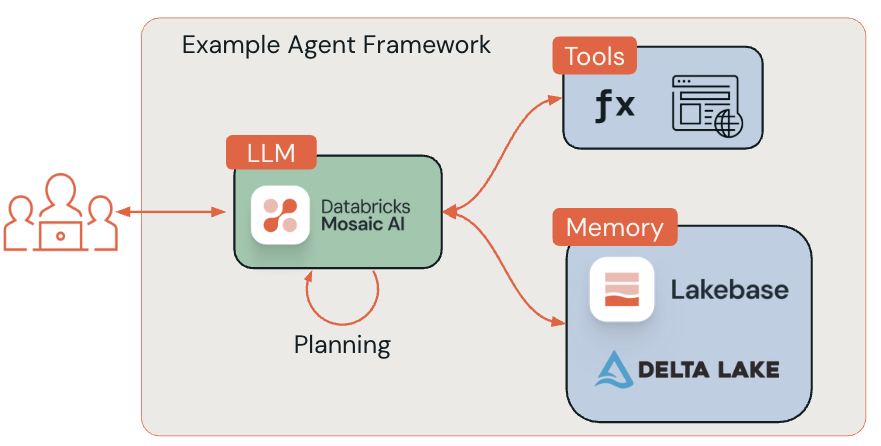
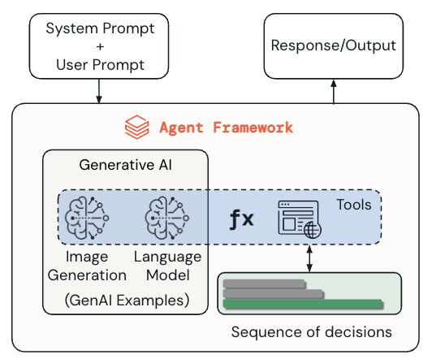
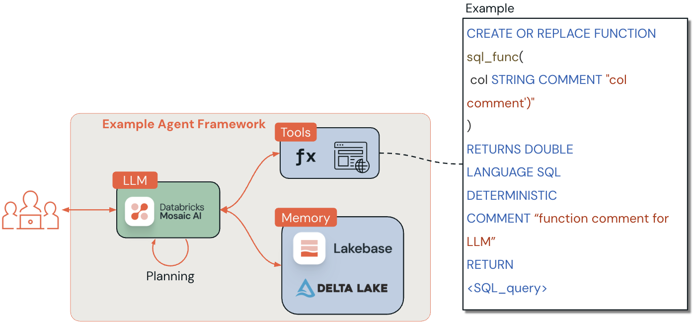
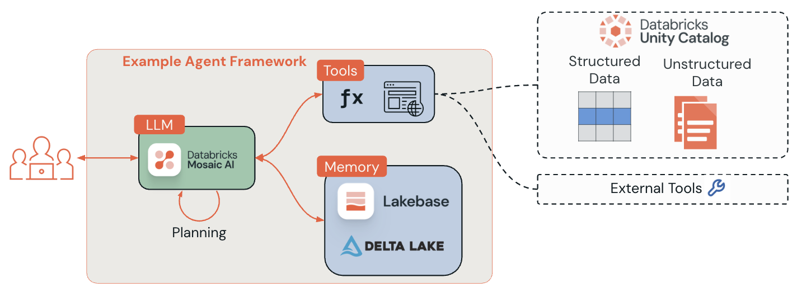

<div style="text-align: center; line-height: 0; padding-top: 9px;">
  
</div>

# Lecture - Authoring Single AI Agents with Databricks Mosaic AI Agent Framework

This lecture notebook explores how Databricks supports the development of single AI agents through its comprehensive Mosaic AI Agent Framework. We'll examine the tools, frameworks, and best practices for creating production-ready AI agents on the Databricks platform.

## Overview

The Databricks Mosaic AI Agent Framework provides a unified platform for authoring, deploying, and monitoring AI agents. This framework supports multiple popular agent development libraries including LangChain, LangGraph, DSPy, and OpenAI, while providing native integration with Databricks services like Vector Search, Model Serving, and MLflow.

The framework emphasizes production readiness through features like automatic tracing, comprehensive evaluation capabilities, and seamless deployment to Mosaic AI Model Serving. Whether you're building simple chat agents or complex multi-agent systems, Databricks provides the tools and infrastructure needed for enterprise-scale AI applications.

## Learning Objectives

_By the end of this lecture, you will be able to:_
- Understand the architecture and components of Databricks Mosaic AI Agent Framework
- Explain the benefits of using ResponsesAgent for production-grade agent development
- Identify the supported agent authoring frameworks and their integration patterns
- Describe the deployment considerations for agents
- Recognize advanced features like streaming, custom inputs/outputs, and retriever integration

## A. Introduction to Mosaic AI Agent Framework



The Databricks Mosaic AI Agent Framework represents a comprehensive solution for building, deploying, and managing AI agents at enterprise scale. This framework addresses the complete _agent lifecycle_ from development to production monitoring.

### An Agent's Lifecycle
An agent's lifecycle can be summarized as follows:
1. **Prepare data and create tools**:
    - This phase includes AI-related ETL using Notebooks, SQL queries, and the Lakeflow suite. Typically, this is where the AI engineer embeds and indexes unstructured data with Vector Search.
    - Once the data is prepared, the engineer moves on to creating tools in either SQL or Python syntax and registers those tools in [Unity Catalog](https://docs.databricks.com/aws/en/data-governance/unity-catalog/) for comprehensive governance.
1. **Rapid prototyping with quality checks**
    - In this phase, typically rapid tests are performed with AI Playground's no-code interface for rapid prototyping agents. Here you can specify a system prompt, select different models and compare them side-by-side and vibe check the results.
    - The AI engineer then evaluates the content with [evaluation tools with MLflow 3](https://docs.databricks.com/aws/en/mlflow3/genai/eval-monitor/), which is designed to help you identify quality issues and the root cause of those issues.
    - Once rapid prototyping has been completed, you can export the code from the playground and leverage `mlflow.genai.evaluate()` (read more [here](https://docs.databricks.com/aws/en/mlflow3/genai/eval-monitor/concepts/eval-harness)).
1. **Evaluate and collect feedback**
    - Test the agent against evaluation datasets using methods such as LLM judges, stakeholder labeling, and synthetic data. Stakeholder/domain expert feedback is gathered, typically through review apps or direct tracing of interactions.
1. **Label data and feedback**
    - Interactions and outputs are labeled to create high-quality benchmarks for testing future agent iterations. This creates an evaluation set that serves as ground truth for quality assessment.
    - Labeling sessions provide a structured way to gather feedback from domain experts on the behavior of your GenAI applications. You can read more about labeling sessions [here](https://docs.databricks.com/aws/en/mlflow3/genai/human-feedback/concepts/labeling-sessions).
1. **Iterative improvement**
    - Use feedback and benchmark results to identify and fix root causes of quality issues.
    - Evaluate multiple versions/configurations to achieve the desired balance of accuracy, safety, cost, and latency.
1. **Deploy to production**
    - The agent moves from development to a scalable, production-ready environment (often REST API via Model Serving). Here, agents are governed for access and compliance, leveraging components such as Unity Catalog for unified governance.
1. **Monitor quality and performance**
    - Post-deployment, agents are continuously monitored using the same evaluation and tracing tools as in development. Logs, traces, user feedback, and automated judges provide ongoing quality signals; new data from production interactions is incorporated into evaluation sets for future improvements.
    - [AI Gateway-enhanced](https://docs.databricks.com/aws/en/ai-gateway/) inference tables are automatically enabled for deployed agents, which provides access to detailed request log metadata when using the Mosaic AI Agent Framework with popular agent authoring libraries like DSPy and LangChain.
    - [MLflow tracing](https://docs.databricks.com/aws/en/mlflow3/genai/tracing/) can be leveraged for end-to-end observability.
    - [Production monitoring for GenAI lets you automatically run MLflow scorers on traces from production GenAI apps](https://docs.databricks.com/aws/en/mlflow3/genai/eval-monitor/production-monitoring)

> The demo that follows this lecture will focus on prototyping agents with supported frameworks.

### A1. Framework Architecture



Assuming you have completed initial testing of your UC/external tools both in Notebooks/SQL Editor and the AI Playground, you are now ready to take a look at agent frameworks. To aid with this, Databricks offers a suite of tooling to author, deploy, and monitor high-quality agentic and RAG applications with the Mosaic AI Agent Framework. This framework is built around several key components:

- **MLflow 3 Integration**: Provides experiment tracking, model logging, and lifecycle management
- **ResponsesAgent Interface**: A production-ready interface compatible with OpenAI Responses schema
- **Agent Authoring Libraries**: Support for LangChain, LangGraph, DSPy, and OpenAI
- **Databricks AI Bridge**: Integration packages that connect agents to Databricks AI features
- **Agent Governance**: Tools and agents are registered and governed in UC; inference logs/traces via AI Gateway and MLflow tracing.
- **Mosaic AI Model Serving**: Scalable deployment infrastructure for production agents
- **Evaluation & Monitoring**: Built-in tools for agent quality assessment and performance tracking

### A2. Requirements and Setup

To develop agents using the Databricks framework, you will need to be aware of some technical platform requirements and packages.

**Core Requirements:**
- `databricks-agents` 1.2.0 or above
- `mlflow` 3.1.3 or above
- Python 3.10 or above
- Serverless compute or Databricks Runtime 13.3 LTS or above

**Installation Command:**
```python
%pip install -U -qqqq databricks-agents mlflow
```

**AI Bridge Integration Packages:**
The Databricks AI Bridge library provides a shared layer of APIs to interact with Databricks AI features, such as Databricks AI/BI Genie and Vector Search. You can see the latest release notes and versions on [PyPi](https://pypi.org/project/databricks-ai-bridge/).
- `databricks-openai` for OpenAI integration
- `databricks-langchain` for LangChain/LangGraph integration
- `databricks-dspy` for DSPy integration
- `databricks-ai-bridge` for pure Python agents (without dedicated integration packages)

## B. ResponsesAgent: The Production Interface

Databricks recommends the MLflow `ResponsesAgent` interface as the primary method for creating production-grade agents. This interface provides compatibility with the OpenAI Responses schema while adding Databricks-specific enhancements.

> If you are familiar with [`ChatAgent`](https://docs.databricks.com/aws/en/generative-ai/agent-framework/agent-legacy-schema), `ResponsesAgent` is meant to replace this interface for new agents.

### B1. ResponsesAgent Benefits

The `ResponsesAgent` interface offers significant advantages over traditional agent interfaces, [while also supporting wrapping existing agents in supporting frameworks](https://docs.databricks.com/aws/en/generative-ai/agent-framework/author-agent?language=Streaming+with+code+re-use#what-if-i-already-have-an-agent).

**Advanced Agent Capabilities:**
- Multi-agent support for complex workflows
- Streaming output with real-time response chunks
- Comprehensive tool-calling message history
- Tool-calling confirmation support
- Long-running tool execution support

**Streamlined Development & Deployment:**
- Framework-agnostic: Wrap any existing agent for Databricks compatibility
- Typed authoring interfaces with IDE autocomplete support
- Automatic signature inference during model logging
    > If you are not use the recommended `ResponsesAgent` interface, you must either manually define your signature or use MLflow's Model Signature inferencing capabilities to automatically generate the agent's signature based on input examples. Read more [here](https://docs.databricks.com/aws/en/generative-ai/agent-framework/log-agent#infer-model-signature-during-logging).
- Automatic tracing with aggregated streamed responses via `predict` and `predict_stream`
    > `ResponsesAgent` requires implementing a `predict` method that returns `ResponsesAgentResponse` to handle non-streaming requests. On the other hand, for streaming agents, you can implement a `predict_stream` method. This goes beyond the scope of this lecture, but you can read more [here](https://docs.databricks.com/aws/en/generative-ai/agent-framework/author-agent?language=Streaming+with+code+re-use).
- AI Gateway-enhanced inference tables for detailed logging

### B2. `ResponsesAgent` Schema Structure

The `ResponsesAgent` uses a structured schema for inputs and outputs:

**Input Format (`ResponsesAgentRequest`):**
```python
{
"input": [
{
"role": "user",
"content": "What did the data scientist say when their Spark job finally completed?"
}
]
}
```

**Output Format (`ResponsesAgentResponse`):**
```python
ResponsesAgentResponse(
output=[
{
"type": "message",
"id": str(uuid.uuid4()),
"content": [{"type": "output_text", "text": "Well, that really sparked joy!"}],
"role": "assistant",
}
]
)
```

### B3. Wrapping Existing Agents

If you already have an agent built with LangChain, LangGraph, or similar frameworks, you don't need to rewrite it. Instead, create a wrapper class that inherits from `mlflow.pyfunc.ResponsesAgent`:

**Basic Wrapper Pattern:**
```python
from uuid import uuid4
from mlflow.pyfunc import ResponsesAgent
from mlflow.types.responses import ResponsesAgentRequest, ResponsesAgentResponse

class MyWrappedAgent(ResponsesAgent):
    def __init__(self, agent):
        # Reference your existing agent (LangChain/LangGraph/OpenAI, etc.)
        self.agent = agent

    def prep_msgs_for_llm(self, messages: list[dict]) -> list[dict]:
        # Implement conversion from ResponsesAgentRequest messages to your agent's expected format
        return messages

    def predict(self, request: ResponsesAgentRequest) -> ResponsesAgentResponse:
        # Convert incoming messages to your agent's format
        messages = self.prep_msgs_for_llm([i.model_dump() for i in request.input])

        # Call your existing agent (non-streaming)
        agent_response = self.agent.invoke(messages)

        # Ensure string output; convert if necessary
        if not isinstance(agent_response, str):
            agent_response = str(agent_response)

        # Convert to ResponsesAgent format
        output_item = self.create_text_output_item(text=agent_response, id=str(uuid4()))
        return ResponsesAgentResponse(output=[output_item])
```

## C. Supported Agent Authoring Frameworks

Databricks supports multiple popular frameworks for agent development, each with specific strengths and use cases.



### C1. LangChain Integration

LangChain is a comprehensive framework for building LLM applications with extensive integrations and capabilities.

**Key Features on Databricks:**
- Use Databricks-served models as LLMs or embeddings
- Integration with Mosaic AI Vector Search for vector storage
- MLflow experiment tracking and performance monitoring
- MLflow Tracing for development and production observability
- PySpark DataFrame loader for seamless data integration
- Spark DataFrame Agent and Databricks SQL Agent for natural language querying

**Example Usage:**
```python
from databricks_langchain import ChatDatabricks

chat_model = ChatDatabricks(
endpoint="databricks-gpt-5-1",
temperature=0.1,
max_tokens=250,
)
chat_model.invoke("How to use Databricks?")
```
> Keep in mind that [LangChain on Databricks](https://docs.databricks.com/aws/en/large-language-models/langchain) for LLM development are experimental features and the API definitions might change over time.

### C2. DSPy Framework

[DSPy](https://docs.databricks.com/aws/en/generative-ai/dspy#what-is-dspy) is a framework for programmatically defining and optimizing generative AI agents with automated prompt engineering capabilities.

**Core DSPy Components:**
- **Modules**: Components handling specific text transformations (replacing hand-written prompts)
- **Signatures**: Natural language descriptions of input/output behavior ("question -> answer")
- **Compiler**: Optimization tool that improves pipelines by adjusting modules for performance metrics
- **Program**: Connected modules forming a pipeline for complex tasks

**DSPy Advantages:**
- Automated prompt optimization
- Systematic approach to agent improvement
- Built-in performance optimization capabilities
- Programmatic rather than manual prompt engineering



### C3. OpenAI Integration

Databricks provides native support for OpenAI-style agents while leveraging Databricks-hosted models.

**Integration Benefits:**
- Use familiar OpenAI API patterns
- Leverage Databricks Foundation Model APIs
- Seamless migration from OpenAI to Databricks models
- Support for both streaming and non-streaming responses
- Tool-calling capabilities with Databricks models

### C4. LangGraph for Complex Workflows

LangGraph extends LangChain with graph-based agent orchestration for more complex, stateful workflows.

**LangGraph Capabilities:**
- Graph-based agent workflows
- State management across agent interactions
- Complex decision trees and conditional logic
- Multi-step reasoning and tool coordination

## D. Streaming and Real-Time Responses

Streaming capabilities allow agents to provide real-time responses in chunks, improving user experience and enabling interactive applications. The idea is to wait for a complete response before sending the result to a user. With MLflow, you can not only view the agent's response, but also these chunks and thought processes, which can lead to insight as to why it chose or did not choose to use a particular tool.

> [The Knowledge Assistant with Agent Bricks](https://docs.databricks.com/aws/en/generative-ai/agent-bricks/knowledge-assistant) has full streaming support, as seen in the screenshot below showing the trace of a KA response.

### D1. Streaming Implementation

To implement streaming with `ResponsesAgent`, follow this pattern:

1. **Emit Delta Events**: Send multiple `output_text.delta` events with the same `item_id`
2. **Finish with Done Event**: Send a final `response.output_item.done` event containing complete output

**Streaming Benefits:**
- Real-time user feedback
- Improved perceived performance
- Better user engagement for long-running operations
- Automatic MLflow tracing integration
- Aggregated responses in AI Gateway inference tables

### D2. Error Handling in Streaming

Mosaic AI propagates streaming errors through the last token under `databricks_output.error`:

```json
{
  "delta": "...",
  "databricks_output": {
    "trace": {...},
    "error": {
      "error_code": "BAD_REQUEST",
      "message": "TimeoutException: Tool XYZ failed to execute."
    }
  }
}
```

**Note:** Client applications must handle and surface these errors appropriately.

## E. (Optional) Advanced Features and Customization

The Databricks Agent Framework provides several advanced features for sophisticated agent implementations. The topics given below go beyond the scope of this course.

### E1. Custom Inputs and Outputs

Some scenarios require additional agent inputs (like `client_type`, `session_id`) or outputs (like retrieval source links) that shouldn't be included in chat history.

**Custom Fields Support:**
- `custom_inputs`: Additional input parameters beyond standard messages. You can read more about custom inputs and output [here](https://docs.databricks.com/aws/en/generative-ai/agent-framework/author-agent#custom-inputs-and-outputs).
- `custom_outputs`: Additional output data not part of conversation flow
- Access via `request.custom_inputs` in agent code
- JSON configuration in AI Playground and review apps

**Important Limitation:**
The Agent Evaluation review app does not support rendering traces for agents with additional input fields.

> You can read more about advanced features in this regard [here](https://docs.databricks.com/aws/en/generative-ai/agent-framework/author-agent#advanced-features). This goes beyond the scope of this course.

### E2. Retriever Integration and Schema

AI agents commonly use retrievers for unstructured data from vector search indices. Databricks provides specialized support for retriever tracing and evaluation. You can read more about retriever integration [here](https://docs.databricks.com/aws/en/generative-ai/agent-framework/unstructured-retrieval-tools#set-retriever-schema-to-ensure-mlflow-compatibility).

**Retriever Benefits:**
- Automatic source document links in AI Playground UI
- Automatic retrieval groundedness and relevance evaluation
- Integration with Databricks AI Bridge retriever tools

**Custom Retriever Schema:**
```python
import mlflow

mlflow.models.set_retriever_schema(
name="mlflow_docs_vector_search",
primary_key="document_id",      # Document ID field
text_column="chunk_text",       # Content field
doc_uri="doc_uri",             # Document URI field
other_columns=["title"],        # Additional metadata
)
```

> This goes beyond the scope of this course. You can read more about retriever tools [here](https://docs.databricks.com/aws/en/generative-ai/agent-framework/unstructured-retrieval-tools).

### E3. Multi-Agent Systems

Databricks supports complex multi-agent systems where multiple specialized agents collaborate to solve problems.

> This goes beyond the scope of this course. To learn more about multi-agent systems managed by databricks, you can read documentation on [Genie](https://docs.databricks.com/aws/en/generative-ai/agent-framework/multi-agent-genie) and [Agent Bricks](https://docs.databricks.com/aws/en/generative-ai/agent-bricks/multi-agent-supervisor). You can read more about Genie with multi-agent systems [here](https://docs.databricks.com/aws/en/generative-ai/agent-framework/multi-agent-genie).

### E4. Stateful Agents

Stateful agents can maintain memory across conversation threads and provide conversation checkpointing capabilities.

> This goes beyond the scope of this course. To learn more about stateful agents, please see [this](https://docs.databricks.com/aws/en/generative-ai/agent-framework/stateful-agents) documentation. You can read more about stateful AI agents [here](https://docs.databricks.com/aws/en/generative-ai/agent-framework/stateful-agents).

## Conclusion

The Databricks Mosaic AI Agent Framework provides a comprehensive platform for building production-ready AI agents. Key takeaways include understanding popular framework strengths (e.g. LangChain), develop and understanding for best practices when building an agent's lifecycle, and production considerations.

---

&copy; 2026 Databricks, Inc. All rights reserved. Apache, Apache Spark, Spark, the Spark Logo, Apache Iceberg, Iceberg, and the Apache Iceberg logo are trademarks of the <a href="https://www.apache.org/" target="_blank">Apache Software Foundation</a>.<br/><br/><a href="https://databricks.com/privacy-policy" target="_blank">Privacy Policy</a> | <a href="https://databricks.com/terms-of-use" target="_blank">Terms of Use</a> | <a href="https://help.databricks.com/" target="_blank">Support</a>
