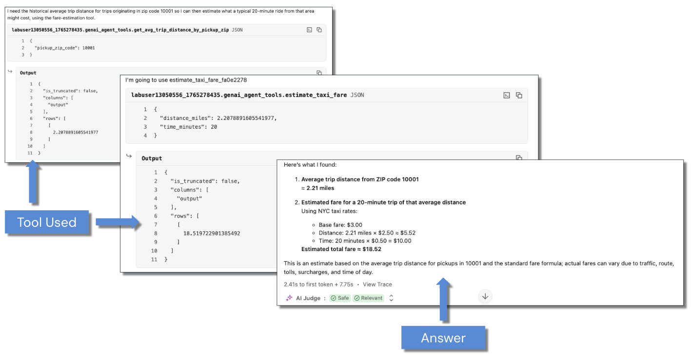

<div style="text-align: center; line-height: 0; padding-top: 9px;">
  
</div>

# Demo - Building Single Agents with LangChain

This demonstration explores how to create AI agents that leverage Unity Catalog (UC) functions as tools within the LangChain framework. You will integrate UC tools with LangChain toolkits and build an agent capable of reasoning and taking action using foundation models hosted in Mosaic AI Model Serving.

## Learning Objectives

By the end of this lesson, you will be able to:
- Understand the separation of tasks between tools, models, and agentic frameworks
- Know the process of registering, testing, and integrating Unity Catalog functions with LangChain using the `UCFunctionToolkit`
- Configure and execute a LangChain agent with tool-calling capabilities
- Know how to view and interpret the trace summary of agent execution and analyze decision-making using MLflow

## A. Environment Setup and Prerequisites

### A1. Compute Requirements

**🚨 REQUIRED - SELECT SERVERLESS COMPUTE**

This course has been configured to run on Serverless compute. While classic compute may also work, testing has been performed on serverless.

**This demo was tested using version 4 of Serverless compute.** To ensure that you are using the correct version of Serverless, please [see this documentation on viewing and changing your notebook's Serverless version.](https://docs.databricks.com/aws/en/compute/serverless/dependencies)

### A2. Install Dependencies

As part of the workspace setup, several Python libraries have been installed. To see the list of notebook-scoped libraries, please read [this documentation](https://docs.databricks.com/aws/en/compute/serverless/dependencies#configure-environment-for-job-tasks).

**NOTE:** If you are familiar with `langchain-databricks`, note that `databricks-langchain` replaces it. This demonstration uses LangChain, but a similar approach can be applied to other libraries.

```python
%run ../Includes/Classroom-Setup-2.1
```

### A3. Inspect the Airbnb Dataset
As a part of the classroom setup, the Airbnb dataset has been processed and stored as a Delta table within Unity Catalog. Run the next cell to query the first few rows of the dataset.

```python
df = spark.read.table('sf_airbnb_listings')
display(df.limit(5))
```

## B. Initialize the Databricks Function Client

The `DatabricksFunctionClient` provides a programmatic interface for executing Unity Catalog functions. We configure it for serverless execution mode to align with our compute requirements. This will be used to test our registered UC functions.

```python
from unitycatalog.ai.core.databricks import DatabricksFunctionClient

# client = DatabricksFunctionClient()  # For classic compute
client = DatabricksFunctionClient(execution_mode="serverless")  # For serverless compute
```

## C. Understanding Agent Concepts

It's important to understand that when using an agentic framework, we should independently test three core components of modern agents:

1. Tool building
2. Choice of large language model (LLM)/small language model (SLM)
3. Choice of agentic framework

### C1. Quick Review of Agent Concepts

When building a single agent, it's important to understand how these components make up an agent. In short, _an AI agent has the ability to view and analyze its environment (plan) and take action (use tools) to achieve a specific goal_. Let's break this down a little more:

1. **Tool building**: This is agnostic of the underlying LLM/SLM (as long as it is capable of tool calling) and _any_ agentic framework. Building executable tools must be thoroughly tested prior to equipping an LLM/SLM to ensure reliability and consistency.
2. **LLM/SLM**: You must have a language model that has the essential agentic capability of _deciding_ whether to call a tool or not based on its perceived plan, which is guided by prompts and system policies. Therefore, it is important to keep in mind that an LLM/SLM alone _may be_ considered an agent, even though its reasoning loop may be quite shallow, if it is able to act in its environment based on the outcome of its reasoning loop.
3. **Agentic Framework**: The underlying framework should be pluggable across common LLMs and exists to orchestrate the _behavior_ of the model via framework-specific policies (e.g., state/memory management and tracing).

### C2. Focus Areas for This Demonstration

With this in mind, please note that this demonstration _will not_ be concerned with building tools or what to consider when selecting an LLM/SLM. Instead, we will focus on:

1. How to configure and equip a LangChain agent (tool-calling LLM + LangChain framework) with Unity Catalog tools
2. How to execute a LangChain agent
3. Performing basic tracing with MLflow

## D. Integrate Unity Catalog Functions with LangChain

We can leverage `databricks_langchain` to wrap UC functions as tools that can be directly integrated into LangChain.

**`UCFunctionToolkit`** is a component of the Databricks-LangChain integration. It acts as a bridge between Unity Catalog user-defined functions (UDFs) and agent frameworks (like LangChain). When you wrap a Unity Catalog function with `UCFunctionToolkit`, it makes that function accessible as a "tool" that an LLM agent can call programmatically.

### D1. Define the Tool List

First, let's make a list of the functions we want to use called `function_names`. When using `UCFunctionToolkit`, you must include the catalog and schema.

```python
tool_list_raw = [
    'avg_neigh_price',
    'cnt_by_room_type'
]

function_names = []
for tool in tool_list_raw:
    tool = catalog_name + '.' + schema_name + '.' + tool
    function_names.append(tool)

print(f"Tool list: {function_names}")
```

### D2. Create the UCFunctionToolkit

The toolkit wraps our Unity Catalog functions and makes them available as LangChain tools.

```python
from databricks_langchain import UCFunctionToolkit

# Create a toolkit with the Unity Catalog functions
toolkit = UCFunctionToolkit(function_names=function_names)
tools = toolkit.tools
```

### D3. Test the Toolkit

Now that our toolkit has been created, let's perform a quick check to make sure we can execute the tools using it. Here we execute example payloads using the toolkit defined by `tools` previously and the `DatabricksFunctionClient` by sending test payloads using the `execute_function` API. Note the output from the next two cells will be the same as testing with SQL queries like we did above.

```python
payload1 = {'neighborhood_name': 'Mission'}
payload1_test_result = client.execute_function(
    function_name=tools[0].uc_function_name,
    parameters=payload1
)
print(payload1_test_result.value)
```

```python
payload2 = {
    'neighborhood_name': 'Mission',
    'room_type_filter': 'Private room'
}
payload2_test_result = client.execute_function(
    function_name=tools[1].uc_function_name,
    parameters=payload2
)
print(payload2_test_result.value)
```

### D4. Progress Checkpoint

To recap, so far we have:

1. Built UC functions and registered those functions to UC via SQL queries.
2. Tested our UC functions locally in this notebook using SQL queries.
3. Created a **LangChain** toolkit called `tools` and tested this toolkit using the same sample payloads as in the previous step.

Next, we will configure and execute the agent.

## E. Configure and Execute the Agent

The `AgentExecutor` method from `langchain.agents` acts as the orchestrator for the LLM to repeatedly invoke the agent's decision function, handle tool execution, and manage the flow of information between the reasoning, action, and observation steps.

### E1. Load Agent Configuration

For clarity, we have stored the endpoint we wish to query, the LLM's temperature value, and the system prompt in another file called `demo_agent.json`. Decoupling the agent's configuration from this main notebook helps with debugging and updates. Let's first read in this configuration using `json.load()`.

```python
import json

# Load JSON file
with open("./demo_agent.json", "r") as f:
    config = json.load(f)

llm_endpoint = config['llm_endpoint']
llm_temperature = config['llm_temperature']
system_prompt = config["system_prompt"]

print("Endpoint:", llm_endpoint)
print("Temperature:", llm_temperature)
print("System Prompt:", system_prompt)
```

### E2. Optional Exercise

To demonstrate how the framework is independent of the LLM, try switching out the LLM endpoint name by navigating to **Serving** in the menu bar to the left.

### E3. Import Required Libraries

Import the necessary Python libraries for building and executing the agent.

```python
from langchain.agents import AgentExecutor, create_tool_calling_agent
from langchain.prompts import ChatPromptTemplate

from databricks_langchain import ChatDatabricks

import mlflow
```

### E4. Initialize the Language Model

Initialize the LLM stored as `llm_endpoint` with temperature `llm_temperature`. We do so using `ChatDatabricks`, which is a class provided by the `databricks-langchain` package that serves as a conversational LLM interface specifically designed for use within LangChain applications.

```python
llm_config = ChatDatabricks(
    endpoint=llm_endpoint,
    temperature=llm_temperature
)
```

### E5. Define the Prompt Template

Here, we use the variable `system_prompt`, which was brought in from `demo_agent.json`. We also configure the chat history, input, and the agent scratchpad.

`ChatPromptTemplate.from_messages()` constructs a reusable template for generating a list of all messages, each with its own role and content, that will be sent to a chat-focused LLM in _sequence_. That is, first a system prompt is used, then we inject the ongoing conversation, followed by the user input and the agent's stepwise reasoning for intermediate results.

```python
prompt_payload = ChatPromptTemplate.from_messages(
    [
        (
            "system",
            system_prompt,
        ),
        ("placeholder", "{chat_history}"),
        ("human", "{input}"),
        ("placeholder", "{agent_scratchpad}"),
    ]
)
```

### E6. Enable MLflow Tracing
Enable automatic tracing with MLflow to capture agent execution details for debugging and analysis. Note that when using a serverless environment, you will need to enable autologging for the MLflow tracing UI to appear as a part of the agent's output. Because MLflow is [integrated with popular GenAI libraries](https://mlflow.org/docs/latest/genai/tracing/#one-line-auto-tracing-integrations), this is actually quite simple to initiate with `mlflow.<framework>.autolog()` as shown in the next cell.

```python
mlflow.langchain.autolog()
```

### E7. Create the Agent Configuration

Define the agent, specifying the LLM's configuration (`llm_config`), tools from the toolkit we defined previously, along with the prompt payload that we defined above (`prompt_payload`).

```python
agent_config = create_tool_calling_agent(
    llm_config,
    tools,
    prompt_payload
)
```

### E8. Execute the Agent

Now that we have our agent's configuration in place, we are ready to execute the agent with `AgentExecutor`. The `verbose=True` parameter enables detailed logging of the agent's reasoning and tool-calling process.

```python
agent_executor = AgentExecutor(agent=agent_config, tools=tools, verbose=True)
response = agent_executor.invoke(
    {
        "input": "Get the average for Mission and tell me the number of properties there that have a shared room"
    }
)
```

## F. High-Level Analysis of the Agent Response and Tracing with MLflow

The MLflow Trace UI is presented as part of the output when running the agent. Click on the **Summary** tab to see a high-level view of the agent's reasoning loop. This provides detailed visibility into the agent's decision-making process.



Your output should look similar to the screenshot, which will include:

- **Which tools were called**: The nature of the query above invokes both tools.
- **What parameters were passed to `ChatDatabricks` and UC tools**: For example, in the image below, we see that for the tool `avg_neigh_price`, the string `Mission` was an input and the output was `{"format": "SCALAR", "value": "229.7557803468208"}`.
- **The results returned from each tool**: For example, if you click on the `ChatDatabricks_2` dropdown arrow, you will see the tool's result fed to the LLM as an input and output as part of the reasoning chain.
- **The final response generated by the agent** with `ChatDatabricks_3`.

The output from the previous cell shows that both of the tools that we created earlier were called.

### F1. Parse the Agent's Response

Parse and display the agent's response in a readable format.

```python
# Extract text segments from the response
output_segments = response['output']

for segment in output_segments:
    if isinstance(segment, dict) and segment.get('type') == 'text':
        print(segment['text'])
```

## Conclusion

By running through this demonstration, you have successfully built a LangChain agent that is attached to your tools stored and governed by Unity Catalog. You learned how to:

- Bridge Unity Catalog functions into LangChain using the `UCFunctionToolkit`
- Configure a foundation model with tool-calling capabilities
- Execute an AI agent that reasons about user queries and invokes appropriate tools
- Trace and analyze agent behavior using MLflow

This approach enables you to build production-ready AI agents that leverage your organization's data assets stored in Unity Catalog while maintaining governance, security, and lineage tracking.

---

&copy; 2026 Databricks, Inc. All rights reserved. Apache, Apache Spark, Spark, the Spark Logo, Apache Iceberg, Iceberg, and the Apache Iceberg logo are trademarks of the <a href="https://www.apache.org/" target="_blank">Apache Software Foundation</a>.<br/><br/><a href="https://databricks.com/privacy-policy" target="_blank">Privacy Policy</a> | <a href="https://databricks.com/terms-of-use" target="_blank">Terms of Use</a> | <a href="https://help.databricks.com/" target="_blank">Support</a>
