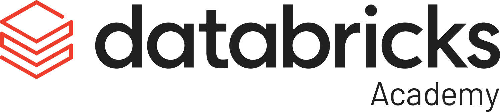
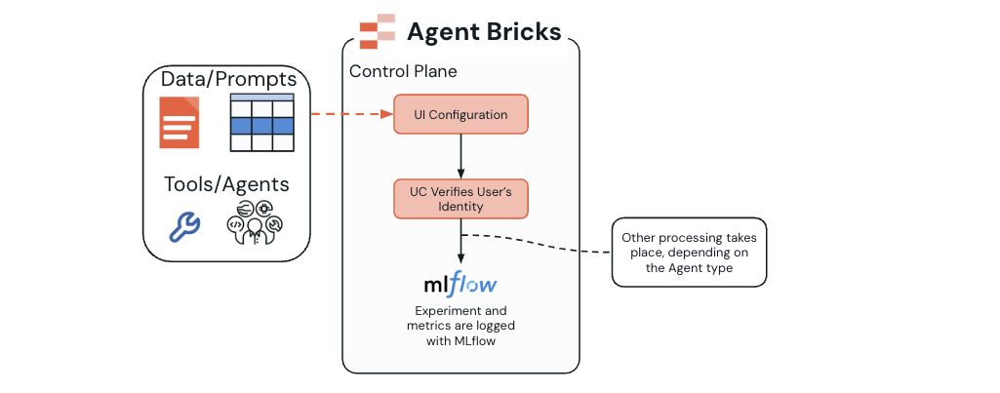
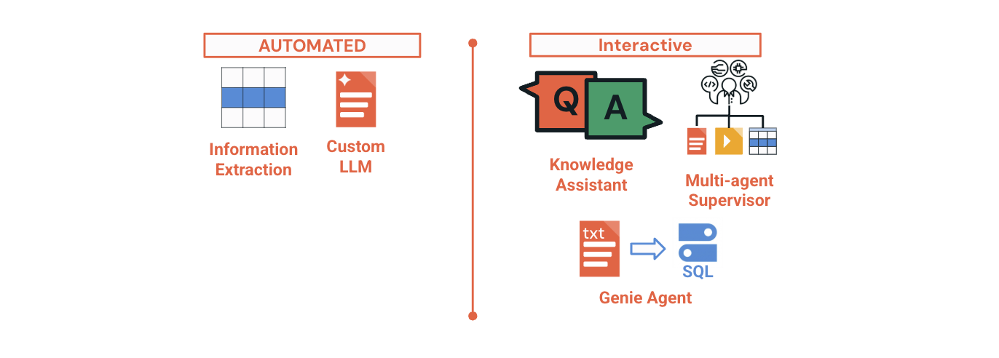
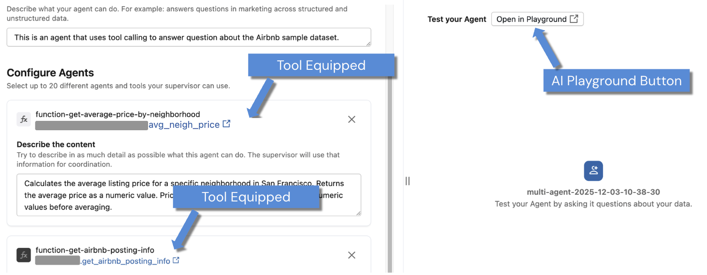
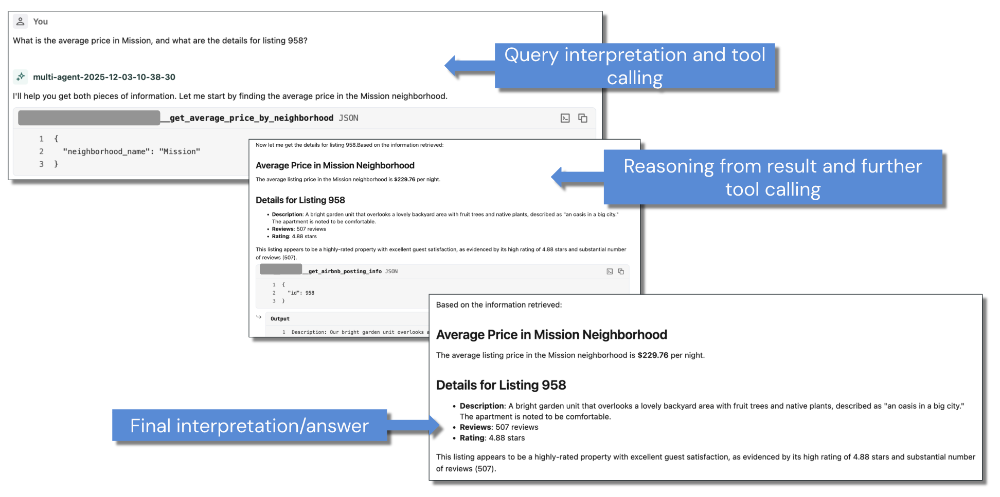
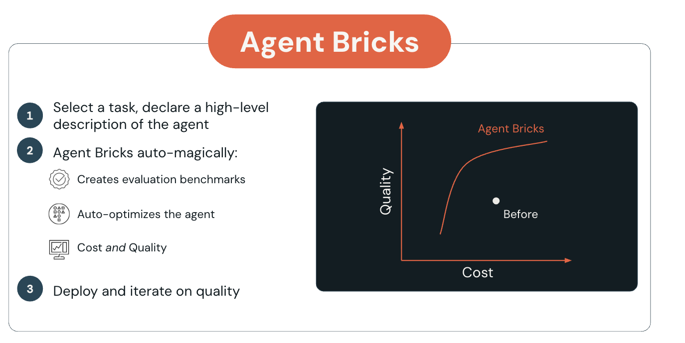
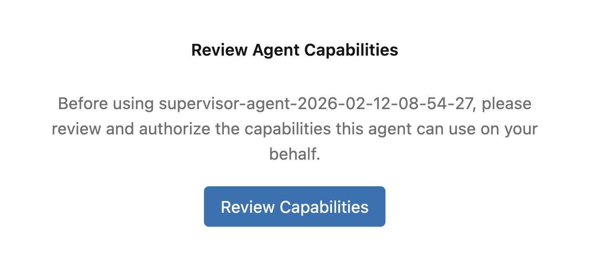
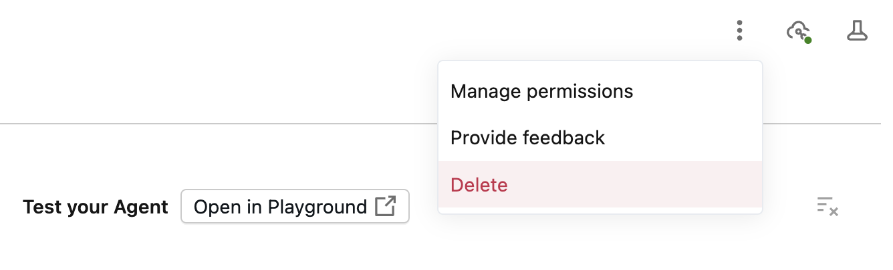
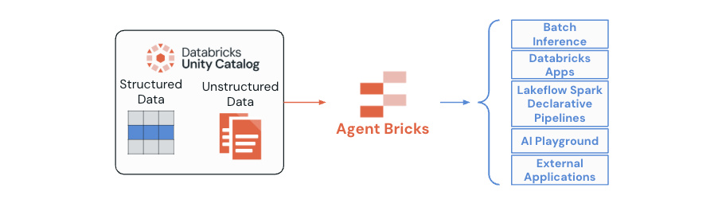

  

# Lecture - Single Agents with Agent Bricks

## Overview

Agent Bricks provides a high-level abstraction designed to help technical users quickly build and optimize production-ready, domain-specific AI agents, focusing on automatic evaluation and optimization, including Agent Learning on Human Feedback (ALHF), to maximize quality while balancing cost considerations.

Unlike traditional agent development approaches that require extensive manual configuration and optimization, **Agent Bricks streamlines the implementation process** so users can focus on the problem, data, and metrics instead of low-level technical details. The platform supports four distinct agent types, each optimized for specific use cases and deployment patterns.

## Learning Objectives
_By the end of this lecture, you will be able to:_

- Understand the Agent Bricks development lifecycle and iterative optimization process
- Identify the four supported agent types and their specific use cases
- Explain the differences between automated and interactive agent categories
- Describe the optimization strategies for cost-performance balance
- Recognize the evaluation and monitoring capabilities built into Agent Bricks

## A. Introduction to Agent Bricks

Agent Bricks provides a simple, powerful approach to building domain-specific agent systems. The platform abstracts away much of the complexity traditionally associated with agent development while maintaining the flexibility needed for enterprise applications.

The core philosophy of Agent Bricks is to enable users to focus on defining their business problems and providing relevant data, while the platform handles the technical complexities of agent optimization, evaluation, and deployment. This approach significantly reduces the time-to-value for AI agent implementations in enterprise environments.

### A1. Supported Agent Types and Use Cases

Agent Bricks supports four primary agent types, each designed for specific enterprise use cases and operational patterns. Understanding these distinctions is crucial for selecting the appropriate agent type for your specific requirements.

**The Four Agent Types:**

1. **Information Extraction (IE)**: Automated extraction of structured data from unstructured sources such as documents, PDFs, emails, and images
2. **Custom LLM (CLLM)**: Domain-specific language models fine-tuned and optimized for particular tasks and datasets
3. **Knowledge Assistant (KA)**: Interactive agents that provide question-answering capabilities over knowledge bases using retrieval-augmented generation. That is, KA is a single agent where tool-calling capabilities are restricted to RAG applications.
4. **Multi-Agent Supervisor (MAS)**: Coordination systems that manage and orchestrate multiple specialized agents to complete complex, multi-step tasks. For example, we can equip an MAS with a set of tools and no additional agents and have it act as a single agent with a toolkit.

### Genie Agent
Users can create and use a Genie Agent to use natural language to query databases or other structured data, making data analysis more accessible. Genie agents can be orchestrated with an MAS or can be standalone single agents.

### A2. Operational Categories

Agents are organized into two operational models based on their intended use patterns:

- **Automated Bricks** (Information Extraction and Custom LLM): Optimized for high-scale, batch processing scenarios with minimal human intervention. These agents prioritize cost-performance optimization and throughput.

- **Interactive Bricks** (Knowledge Assistant, Multi-Agent Supervisor, and Genie): Designed for human-in-the-loop experiences and real-time interaction scenarios. These agents focus on conversational interfaces and dynamic response generation.

## B. Agent Bricks Development Lifecycle

The Agent Bricks development process follows a structured, iterative approach designed to optimize agent performance through continuous improvement and feedback incorporation. This lifecycle ensures that agents not only meet initial requirements but continue to improve through real-world usage and feedback.

### B1. Core Three-Step Development Cycle

The Agent Bricks development lifecycle consists of three primary phases that form the foundation of agent development, followed by continuous iteration for ongoing improvement.

**Step 1: Specify Your Problem**

At a high level, the user begins by building an agent that is specific to their use case. For example, with the MAS, you might want a managed agent that allows for only tool calling with a Genie Agent. After setting up proper permissions, MLflow is leveraged for tracking metrics and logging.

In this initial phase, you define the scope and requirements of your AI agent:
- Clearly define the required task and expected outcomes with your team
- Select the appropriate agent type from the four available options: Information Extraction, Custom LLM, Knowledge Assistant, or Multi-Agent Supervisor
- Depending on your use case, you next need to provide your UC-managed datasets (Delta tables, UC Volumes), equip tools, and attach other agents
- Establish success criteria and quality metrics for evaluation

**Step 2: Optimize on Your Enterprise Data**

Agent Bricks automatically builds and optimizes the best agent system based on quality versus cost tradeoffs:
- The system automatically creates evaluation benchmarks related to your specific task (such as Accuracy, Product Relevance, Customer Churn prediction, etc.)
- Optimization involves intelligent selection and composition of multiple techniques:
  - Advanced prompt optimization using proven methodologies
  - Selective fine-tuning based on task requirements and data availability
  - Optimal tool selection and configuration
  - Implementation of Custom LLM Judges for quality assessment
  - Reward Model filtering for response quality improvement
  - Reinforcement Learning from Human Feedback (RLHF) when beneficial

**Step 3: Continuous Improvement**

The final step establishes a feedback loop for ongoing optimization:
- Deploy the optimized agent to production environment
- Continuously measure agent quality through automated and human evaluation
- Systematically identify issues and improvement opportunities through monitoring
- Apply natural language feedback to improve system performance
- Leverage Agent Learning on Human Feedback (ALHF) for iterative enhancement

### B2. Evaluation and Monitoring Framework

Agent Bricks provides comprehensive evaluation and monitoring capabilities built directly into the platform, ensuring continuous visibility into agent performance and quality metrics.

**Automatic MLflow Integration:**

Every agent deployed through Agent Bricks automatically includes comprehensive tracking capabilities:
- **Request Tracking**: Complete logging of all incoming requests with timestamps and user context
- **Response Monitoring**: Detailed capture of outgoing responses including confidence scores and reasoning paths
- **Inter-Agent Communication**: Full tracing of communication between agents in multi-agent systems
- **Performance Metrics**: Automatic collection of latency, throughput, and resource utilization data

**Quality Assessment Mechanisms:**

The platform implements multiple layers of quality evaluation:
- **Automatic Benchmark Creation**: Task-specific metrics tailored to your use case requirements
- **LLM Judge Evaluation**: Automated quality scoring using specialized language models trained for evaluation tasks
- **Human Feedback Integration**: Structured collection and integration of expert feedback through review applications
- **Production Performance Monitoring**: Real-time tracking of agent performance in live environments
- **Comparative Analysis**: Benchmarking against baseline models and previous agent versions

## C. Integration with Other Services

Agent Bricks is tightly integrated with Mosaic AI Model Serving, Vector Search, Unity Catalog, Genie, MLflow 3, and Databricks Apps, **creating a unified platform for building, governing, evaluating, and deploying AI agents end-to-end**. This integration means users can rapidly prototype, iterate, and deploy agent systems using their own enterprise data, while maintaining best-in-class governance, security, and scalability.

#### How Agent Bricks Works Alongside the Databricks Stack

- **Mosaic AI Model Serving**: Agents can be deployed as scalable REST APIs with automatic load balancing and monitoring. This serving platform also provides secure authentication and natively integrates with MLflow 3, enabling real-time tracing and quality evaluation.
- **Vector Search**: Agents tap into Databricks Vector Search to efficiently retrieve relevant unstructured information, supporting both retrieval-augmented generation (RAG) and advanced use cases like semantic search across documents and tables.
- **Unity Catalog**: Ensures unified governance across all data, models, agents, and tools. Agent logic, data lineage, and tool access are controlled to meet regulatory and compliance needs, while supporting integration with enterprise security requirements.
- **Genie & Genie Spaces**: Enable agents to interact directly with structured data (e.g., text-to-SQL queries) and orchestrate multiple tools, expanding agent capabilities (e.g. multi-agent or tool-calling architectures).
- **MLflow 3**: Provides robust experiment tracking, versioning, tracing, and evaluation for agents. Real-time traces and automated quality measurement (with research-backed LLM judges) allow rapid debugging and improvement cycles.
- **Databricks Apps**: Offer user interfaces such as built-in chat apps, feedback collection portals, and production dashboards. These UIs allow stakeholders to interact with agents, submit feedback, and ensure agents meet business needs.

---

&copy; 2026 Databricks, Inc. All rights reserved. Apache, Apache Spark, Spark, the Spark Logo, Apache Iceberg, Iceberg, and the Apache Iceberg logo are trademarks of the <a href="https://www.apache.org/" target="_blank">Apache Software Foundation</a>.  <a href="https://databricks.com/privacy-policy" target="_blank">Privacy Policy</a> | <a href="https://databricks.com/terms-of-use" target="_blank">Terms of Use</a> | <a href="https://help.databricks.com/" target="_blank">Support</a>
