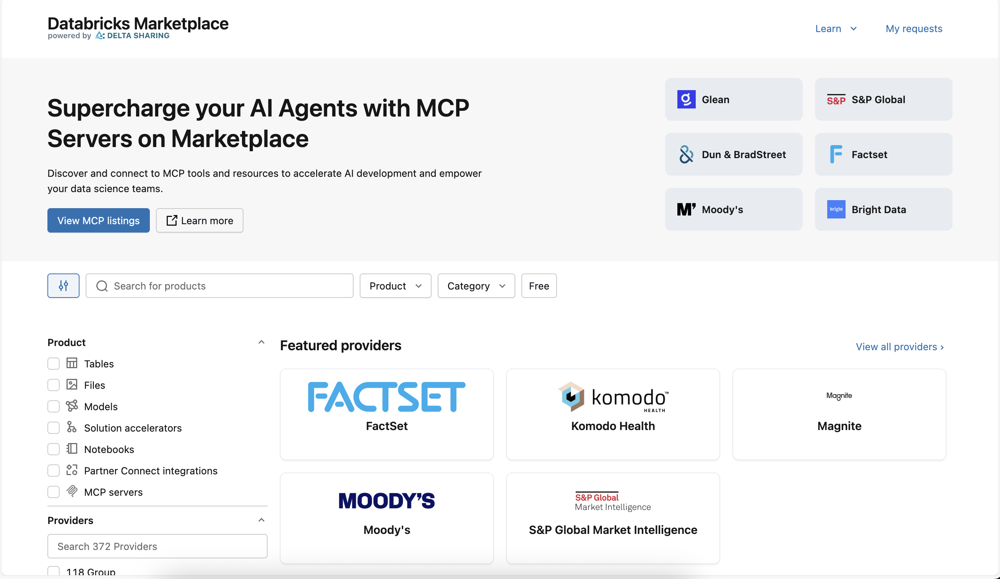
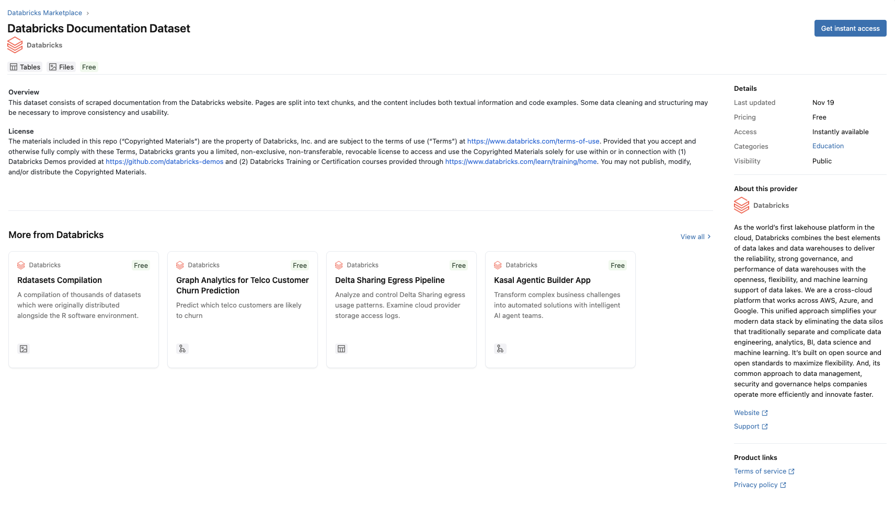
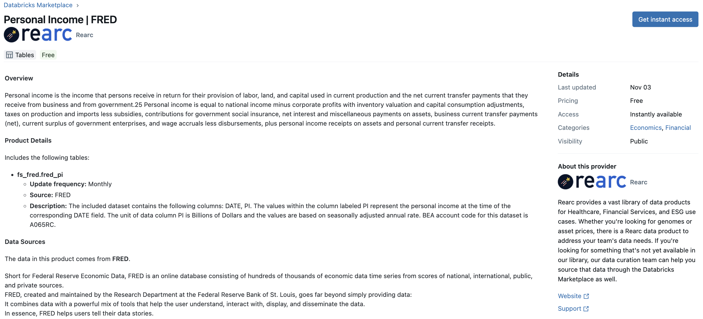

  

# Explore Licensing of Datasets

**In this demo, we will focus on reviewing the licenses associated with data we might want to use for our model.** To do this, we will explore the Databricks Marketplace. There, we will review a specific dataset that we might want to use for one of our models and find its licensing information.

## Demo Overview

The power of modern GenAI applications exists in their ability to become intimately familiar with your enterprise's data. However, there are also use cases where we might want to augment our training data or contextual knowledge data with general industry data. We can find supplementary data using the Databricks Marketplace.

In this demo, we will explore a few datasets on the Databricks Marketplace, with a particular focus on licensing issues and determining whether they'd be a good candidate for using in a particular type of GenAI application.

Here are all the detailed steps:

- Get familiar with Databricks Marketplace and how to find it.
- Look at the license for an example dataset that would be OK for our application.
- Explore another example dataset that might not be OK for us to use.

## Databricks Marketplace

The Databricks Marketplace allows users to discover, explore, and access data and AI resources from a variety of providers. It offers resources such as datasets you can use to power RAG applications or add as features or attributes to your existing pipelines, pre-trained machine learning models, and solution accelerators to help you get from concept to production more quickly and efficiently.

In this demo, we'll be focused on datasets we can use for our RAG application.

There are **two main reasons** we might want to find additional data for our RAG application:

1. We might want additional reference data to augment our prompt as context that we can query at runtime using Vector Search against a vector index.
2. In some scenarios, we may need additional data to use for fine-tuning or further pretraining the LLM powering our overall RAG application – note that this can also be applied outside of RAG applications.

### Why do we want third-party data?

It's true that a lot of your application's contextual data is likely to come from within your company. However, there might be times when information provided by third-party providers can be useful as well. We need to make sure that we're allowed to use that data.

As practitioners, it is critical to be aware of potential licensing restrictions that these datasets may ship with that could prevent you from using that particular dataset for your intended purpose. Every dataset on the Databricks Marketplace should have a license that you can review to determine (along with your appropriate legal counsel) whether it is usable or not.

**Note:** While the focus here is on Databricks Marketplace, the same ideas are equally applicable to data you find anywhere else on the interface, including other data hubs like the one hosted and operated by Hugging Face. Regardless of where you find data for your application, be sure you know the licensing and legal implications.

## Databricks Documentation Dataset

In the first example, we'll look at an Amazon Reviews dataset provided by Bright Data. 

To locate the dataset, follow the below steps:

1. Navigate to the Databricks Marketplace
2. Filter the **Product** filter to "Tables"
3. Filter the **Provider** filter to "Databricks"
4. Open the "Databricks Documentation Dataset"

Let's explore the data to see if it could work for our use case:

* What is the record-level of the dataset?
* What fields does it include?
* How many records does it have?
* How often is the data updated?

Even if the dataset meets our requirements, we need to review its **license** to determine whether or not we're allowed to use it.

To find the license information:

1. Take a look at the **Product links** section under the provider info
2. Click on **License** to open the license information
3. Review the agreement for something like "Acceptable Use"

You'll need to carefully review the license to determine whether it permits your intended purpose with your application. It is highly recommended to take advantage of legal counsel in making any licensing determination.

## Rearc Personal Income | FRED

In the next example, we'll look at a Personal Income dataset from Rearc.

Let's get started with a few questions:

* How would this data be useful for a GenAI application?
* Where is the license information?
* Are we able to use this data for a hypothetical commercial application?

The same advice applies here. Carefully review the license, ideally with the help of appropriate legal counsel before integrating the data into your application or using it to train or fine-tune your models.

### Ingesting the Data

Let's assume we have legal permission to use the data for our use case.

We can ingest it into our environment directly from Databricks Marketplace by clicking the **Get instant access** button on the dataset page in Marketplace.

This will prompt us to:

* determine the name of the catalog in which the data will reside (new or existing).
* accept the terms and conditions.

And then we'll be able to open, explore, and use our data!

---

&copy; 2026 Databricks, Inc. All rights reserved. Apache, Apache Spark, Spark, the Spark Logo, Apache Iceberg, Iceberg, and the Apache Iceberg logo are trademarks of the <a href="https://www.apache.org/" target="_blank">Apache Software Foundation</a>.  <a href="https://databricks.com/privacy-policy" target="_blank">Privacy Policy</a> | <a href="https://databricks.com/terms-of-use" target="_blank">Terms of Use</a> | <a href="https://help.databricks.com/" target="_blank">Support</a>
