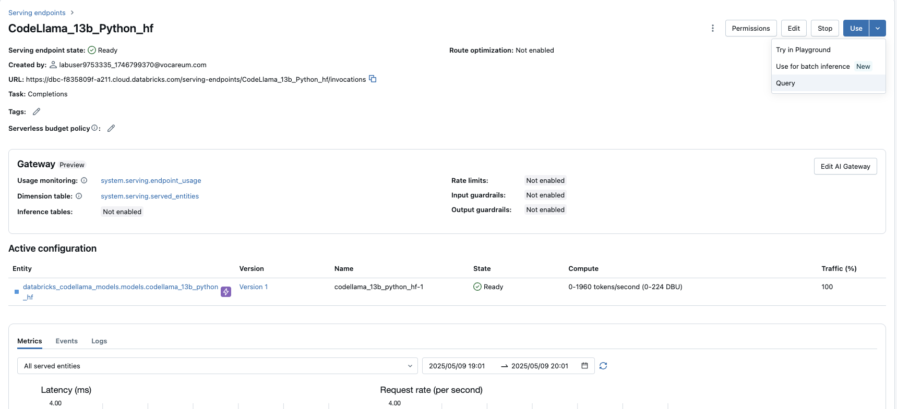
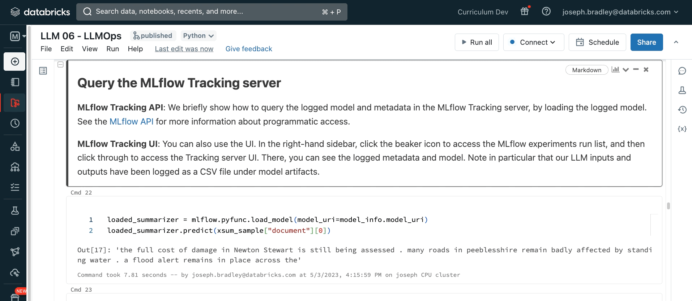

<div style="text-align: center; line-height: 0; padding-top: 9px;">
  
</div>

# Batch Inference Using SLM

In this example, we will walk through some key steps for implementing an LLM-based pipeline using a **Small Language Model (SLM)** for batch inference in a production environment.

**📌 This notebook vs. modular scripts**: Since this demo is contained within a single notebook, we will divide the workflow from development to production into notebook sections. In a more realistic LLM Ops setup, these sections would likely be split into separate notebooks or scripts.

**📌 Promoting models vs. code**: We track the path from development to production via the Model Registry. That is, we are *promoting models* towards production, rather than promoting code.

## Demo Overview

1. Prepare dataset.
1. Develop a Huggingface/transformer LLM pipeline.
1. Apply/test pipeline to data, and log results to MLflow Tracking.
1. Log the pipeline to the MLflow Tracking server as an MLflow Model.
1. Load LLM pipeline from registry and run batch inference
1. Use SQL `ai_query()` for batch inference on existing/supported _Foundation Models API_ models

## Data and Model Preparation

### Prepare Dataset

Prepare a Delta table containing texts to summarize from the [Extreme Summarization (XSum) Dataset](https://huggingface.co/datasets/EdinburghNLP/xsum), which we will use to run batch inferences.

```python
import datasets
from datasets import load_dataset
from transformers import pipeline
from delta.tables import DeltaTable
prod_data_table_name = f"{DA.catalog_name}.{DA.schema_name}.m4_1_prod_data"
datasets.utils.logging.disable_progress_bar()
xsum_dataset = load_dataset(
    "EdinburghNLP/xsum",
    revision="refs/convert/parquet",
    cache_dir=DA.paths.working_dir + "/hf_cache"
)
# Save test set to delta table
test_spark_df = spark.createDataFrame(xsum_dataset["test"].to_pandas())
test_spark_df.write.mode("overwrite").saveAsTable(prod_data_table_name)
```



### Create a Hugging Face Pipeline

For this notebook we'll use the <a href="https://huggingface.co/t5-small" target="_blank">T5 Text-To-Text Transfer Transformer</a> from Hugging Face.

```python
from transformers import pipeline

# Define pipeline inference parameters - to be logged in mlflow as part of model _metadata
hf_model_name = "t5-small"
min_length = 20
max_length = 40
truncation = True
do_sample = True
device_map = "auto" # 'cuda', 'cpu'

cache_dir = "/hf_cache" 

summarizer = pipeline(
    task="summarization",
    model=hf_model_name,
    min_length=min_length,
    max_length=max_length,
    truncation=truncation,
    do_sample=do_sample,
    device_map=device_map,
    model_kwargs={"cache_dir": cache_dir},
)
```

Test the summarizer:

```python
text_to_summarize= """ Barrington DeVaughn Hendricks (born October 22, 1989), known professionally as JPEGMafia (stylized in all caps), is an American rapper, singer, and record producer born in New York City and based in Baltimore, Maryland. His 2018 album Veteran, released through Deathbomb Arc, received widespread critical acclaim and was featured on many year-end lists. It was followed by 2019's All My Heroes Are Cornballs and 2021's LP!, released to further critical acclaim. """

summarized_text = summarizer(text_to_summarize)[0]["summary_text"]
print(f"Summary:\n {summarized_text}")
print("===============================================")
print(f"Original Document: {text_to_summarize}")
```

## Model Development and Registering

### Track LLM Development with MLflow

[MLflow](https://mlflow.org/) Tracking helps track model or pipeline production during development. Even without fitting a model, you can use it to track example queries and responses to the LLM pipeline and store the model as an [MLflow Model flavor](https://mlflow.org/docs/latest/models.html#built-in-model-flavors) for simpler deployment.

MLflow Tracking is organized hierarchically: an [experiment](https://mlflow.org/docs/latest/tracking.html#organizing-runs-in-experiments) corresponds to creating a primary model or pipeline, containing multiple [runs](https://mlflow.org/docs/latest/tracking.html#organizing-runs-in-experiments). Each run logs parameters, metrics, tags, models, artifacts, and other metadata.

GIF of MLflow UI:



```python
import mlflow
from mlflow.models import infer_signature
from mlflow.transformers import generate_signature_output


# It is valuable to log a "signature" with the model telling MLflow the input and output schema for the model.
output = generate_signature_output(summarizer, text_to_summarize)
signature = infer_signature(text_to_summarize, output)
print(f"Signature:\n{signature}\n")


# Set experiment path
model_artifact_path = "summarizer"
experiment_name = f"/Users/{DA.username}/GenAI-As-04-Batch-Demo"
mlflow.set_experiment(experiment_name)
model_artifact_path = "summarizer"

with mlflow.start_run():
    # LOG PARAMS
    mlflow.log_params(
        {
            "hf_model_name": hf_model_name,
            "min_length": min_length,
            "max_length": max_length,
            "truncation": truncation,
            "do_sample": do_sample,
        }
    )

    inference_config = {
        "min_length": min_length,
        "max_length": max_length,
        "truncation": truncation,
        "do_sample": do_sample,
    }

    model_info = mlflow.transformers.log_model(
        transformers_model=summarizer,
        artifact_path=model_artifact_path,
        task="summarization",
        inference_config=inference_config,
        signature=signature,
        input_example="This is an example of a long news article which this pipeline can summarize for you.",
    )
```

### Query the MLflow Tracking server

```python
# Grab most recent run (which logged the model) using our experiment ID
experiment_id = mlflow.get_experiment_by_name(experiment_name).experiment_id
runs = mlflow.search_runs([experiment_id])
last_run_id = runs.sort_values("start_time", ascending=False).iloc[0].run_id

# Construct model URI based on run_id
model_uri = f"runs:/{last_run_id}/{model_artifact_path}"
```

### Load Model Back as a Pipeline

```python
loaded_summarizer = mlflow.pyfunc.load_model(model_uri=model_uri)
loaded_summarizer.predict(text_to_summarize)
```

### Register the Model to Unity Catalog

```python
from mlflow import MlflowClient

# Define model name in the Model Registry
model_name = f"{DA.catalog_name}.{DA.schema_name}.summarizer"

# Point to Unity-Catalog registry and log/push artifact
mlflow.set_registry_uri("databricks-uc")
mlflow.register_model(
    model_uri=model_uri,
    name=model_name,
)
```

## Manage Model Stage

Set latest model version as `@champion`:

```python
def get_latest_model_version(model_name_in):
    """
    Helper method to programmatically get latest model's version from the registry
    """
    client = MlflowClient()
    model_version_infos = client.search_model_versions("name = '%s'" % model_name_in)
    return max([model_version_info.version for model_version_info in model_version_infos])
```

```python
# Set @alias
client = mlflow.tracking.MlflowClient()
current_model_version = get_latest_model_version(model_name)

client.set_registered_model_alias(
  name=model_name, alias="champion",
  version=current_model_version
  )
```

## Create a Production Workflow for Batch Inference

In production the goals are (a) to write scale-out code which can meet scaling demands in the future and (b) to simplify deployment by using MLflow to write model-agnostic deployment code. Step-by-step, we will:
* Load the latest production LLM pipeline from the Model Registry.
* Apply the pipeline to an Apache Spark DataFrame.
* Append the results to a Delta Lake table.

*Model URIs*: Two common URI patterns for the MLflow Model Registry:
* `f"models:/{model_name}/{model_version}"` to refer to a specific model version by number
* `f"models:/{model_name}@{alias}"` to refer to the model version given unique @alias

```python
prod_data_table = f"{DA.catalog_name}.{DA.schema_name}.m4_1_prod_data"
prod_data_df = spark.read.table(prod_data_table).limit(10)
display(prod_data_df)
```

### Single-node Batch Inference

For single-node batch inference, the native `.predict()` method can be used:

```python
latest_model = mlflow.pyfunc.load_model(
  model_uri=f"models:/{model_name}/{current_model_version}"
)
latest_model
```

```python
from pprint import pprint

prod_data_sample_pdf = prod_data_df.limit(2).toPandas()
summaries_sample = latest_model.predict(prod_data_sample_pdf["document"])
[pprint(s+"\n") for s in summaries_sample]
```

### Multinode Batch Inference

Load the model using `mlflow.pyfunc.spark_udf` to return it as a Spark User Defined Function which can be applied efficiently to big data. *Note that the deployment code is library-agnostic: it never references that the model is a Hugging Face pipeline.*

```python
# Grab `Champion` model (supposed to be latest production version)
prod_model_udf = mlflow.pyfunc.spark_udf(
    spark,
    model_uri=f"models:/{model_name}@champion",
    env_manager="local",
    result_type="string",
)
```

```python
# Run inference by appending a new column to the DataFrame
batch_inference_results_df = prod_data_df.withColumn("generated_summary", prod_model_udf("document"))
display(batch_inference_results_df)
```

```python
prod_data_summaries_table_name = f"{DA.catalog_name}.{DA.schema_name}.m4_1_batch_inference"
batch_inference_results_df.write.mode("append").saveAsTable(prod_data_summaries_table_name)
```

## Batch Inference Using `ai_query()`

Another alternative & common method to run "batch-like" jobs using LLMs made available via the databricks foundation models API is to use the `ai_query()` **SQL** function:

```sql
CREATE OR REPLACE TABLE ai_query_inference AS (
  SELECT
  id
  ,ai_query(
    "databricks-meta-llama-3-3-70b-instruct",
    CONCAT("Based on the following document, provide a summary in less than 100 words. Document: ", document)
  ) as generated_summary
 FROM m4_1_prod_data LIMIT 10
)
```

```sql
SELECT * FROM ai_query_inference
```

---

&copy; 2026 Databricks, Inc. All rights reserved. Apache, Apache Spark, Spark, the Spark Logo, Apache Iceberg, Iceberg, and the Apache Iceberg logo are trademarks of the <a href="https://www.apache.org/" target="_blank">Apache Software Foundation</a>.<br/><br/><a href="https://databricks.com/privacy-policy" target="_blank">Privacy Policy</a> | <a href="https://databricks.com/terms-of-use" target="_blank">Terms of Use</a> | <a href="https://help.databricks.com/" target="_blank">Support</a>
