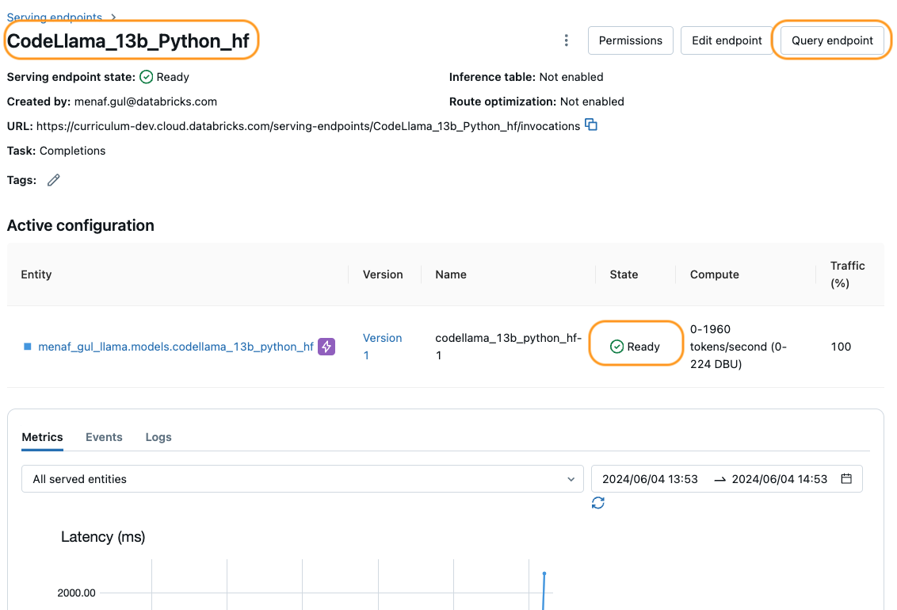
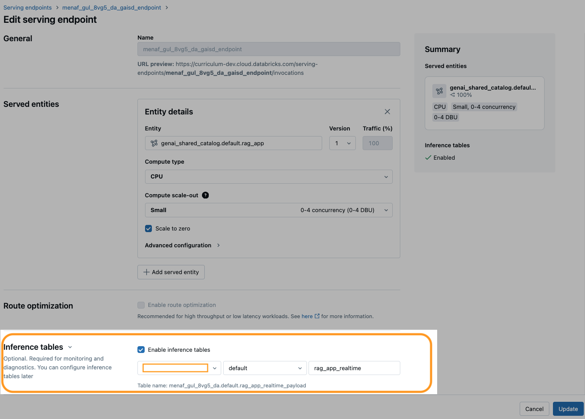
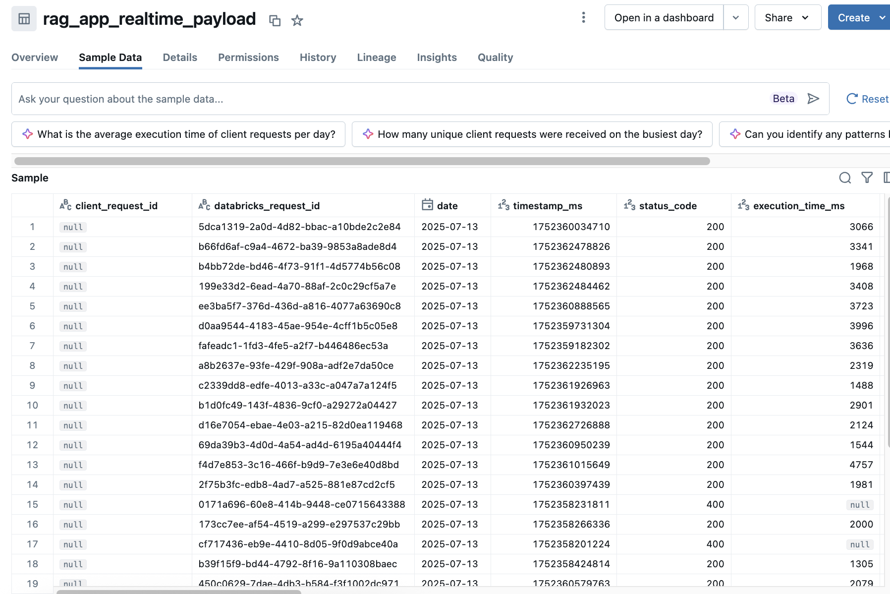

<div style="text-align: center; line-height: 0; padding-top: 9px;">
  
</div>

# Deploying an LLM Chain to Databricks Model Serving

**In this demo, we will focus on deploying and querying GenAI models in realtime.**

Deployment is a key part of operationalizing our LLM-based applications. We will explore deployment options within Databricks and demonstrate how to achieve each one.

## Demo Overview

In this demo, we will walk through basic real-time deployment capabilities in Databricks. Model Serving allows us to deploy models and query it using various methods.

In this demo, we'll discuss this in the following steps:

1. Prepare a model to be deployed.
1. Deploy the registered model to a Databricks Model Serving endpoint.
1. Query the endpoint using various methods such as `python sdk` and `mlflow deployments`.

## Model Preparation

We have created a RAG model as a part of the set up of this lesson and have logged it in Unity Catalog for governance purposes and ease of deployment to Model Serving.

```python
shared_schema_name = f"ws_{spark.conf.get('spark.databricks.clusterUsageTags.clusterOwnerOrgId')}"
model_name = f"genai_shared_catalog_04.{shared_schema_name}.rag_app"
print(f"Pre-created model: {model_name}")
```

```python
import mlflow
from mlflow import MlflowClient

# Point to UC registry
mlflow.set_registry_uri("databricks-uc")

def get_latest_model_version(model_name_in:str = None):
    """
    Get latest version of registered model
    """
    client = MlflowClient()
    model_version_infos = client.search_model_versions("name = '%s'" % model_name_in)
    if model_version_infos:
      return max([model_version_info.version for model_version_info in model_version_infos])
    else:
      return None
```

```python
latest_model_version = get_latest_model_version(model_name)

if latest_model_version:
  print(f"Model created and logged to: {model_name}/{latest_model_version}")
else:
  raise(BaseException("Error: Model not created, verify if 00-Build-Model script ran successfully!"))
```



## Deploy a Custom Model to Model Serving

### Pre-Requisite: Set up Secrets

To secure access to the serving endpoint, set up secrets for the host (workspace URL) and a personal access token. Secrets can be set up using the Databricks CLI:

```
databricks secrets create-scope <scope-name>
databricks secrets put-secret --json '{
  "scope": "genai_training",
  "key": "depl_demo_host",    
  "string_value": "<host-name>"
}'
databricks secrets put-secret --json '{
  "scope": "genai_training",
  "key": "depl_demo_token",    
  "string_value": "<token_value>"
}' 
```

### Deploy model using `databricks-sdk` API

**⏰ Expected deployment time: ~10 mins**

```python
from databricks.sdk.service.serving import EndpointCoreConfigInput

# Configure the endpoint
endpoint_config_dict = {
    "served_models": [
        {
            "model_name": model_name,
            "model_version": latest_model_version,
            "scale_to_zero_enabled": True,
            "workload_size": "Small",
            "environment_vars": {
                "DATABRICKS_TOKEN": "{{{{secrets/{0}/depl_demo_token}}}}".format(DA.scope_name),
                "DATABRICKS_HOST": "{{{{secrets/{0}/depl_demo_host}}}}".format(DA.scope_name)
            },
        },
    ],
    "auto_capture_config":{
        "catalog_name": DA.catalog_name,
        "schema_name": DA.schema_name,
        "table_name_prefix": "rag_app_realtime"
    }
}

endpoint_config = EndpointCoreConfigInput.from_dict(endpoint_config_dict)
```

**Important:** Rather than passing the secret variables directly, follow syntax requirements **`{{secrets/<scope>/<key-name>}}`** so that the endpoint will look up the secrets in real-time rather than automatically configure and expose static values.

```python
from databricks.sdk import WorkspaceClient

# Initiate the workspace client
w = WorkspaceClient()
serving_endpoint_name = f"{DA.unique_name('_')}_endpoint"

# Get endpoint if it exists
existing_endpoint = next(
    (e for e in w.serving_endpoints.list() if e.name == serving_endpoint_name), None
)

db_host = dbutils.notebook.entry_point.getDbutils().notebook().getContext().tags().get("browserHostName").value()
serving_endpoint_url = f"{db_host}/ml/endpoints/{serving_endpoint_name}"

# If endpoint doesn't exist, create it
if existing_endpoint == None:
    print(f"Creating the endpoint {serving_endpoint_url}, this will take a few minutes to package and deploy the endpoint...")
    w.serving_endpoints.create_and_wait(name=serving_endpoint_name, config=endpoint_config)

# If endpoint does exist, update it to serve the new version
else:
    print(f"Updating the endpoint {serving_endpoint_url} to version {latest_model_version}, this will take a few minutes to package and deploy the endpoint...")
    w.serving_endpoints.update_config_and_wait(served_models=endpoint_config.served_models, name=serving_endpoint_name)

displayHTML(f'Your Model Endpoint Serving is now available. Open the <a href="/ml/endpoints/{serving_endpoint_name}">Model Serving Endpoint page</a> for more details.')
```

The model could also be deployed using MLflow's deploy_client:

```python
from mlflow.deployments import get_deploy_client

deploy_client = get_deploy_client("databricks")
endpoint = deploy_client.create_endpoint(
    name=serving_endpoint_name,
    config=endpoint_config
)
```

### (Method 2) - Create Inference Table via Model Serving UI

If an endpoint is already up and running, to set up this inference table manually:

1. Go to [Serving](/ml/endpoints).
1. Locate the endpoint you created earlier.
1. Click on the **Configure AI Gateway** button
1. Click on the **Enable inference tables** button
1. Enter the **catalog**, **schema** and **table** information for the inference table.


**Note:** To set up an inference table, you must configure your endpoint using a Databricks Secret.



## Perform Inference on the Model

### Inference with SDK

```python
from databricks.sdk.service.serving import ChatMessage

messages = {"messages" : [
        {"role": "user", "content": "What is PPO?"}
    ]}

answer = w.serving_endpoints.query(
  serving_endpoint_name, 
  inputs=messages
)

print(answer.predictions)
```

## View the Inference Table

Once the table is created and the endpoint is hit couple times, we can view the table in the Catalog Explorer to inspect the saved query data.

To view the inference table:

1. Go to **[Catalog](explore/data)**.
1. Select the catalog and schema you entered while configuring the inference table in previous step.
1. Select the inference table and view the sample data.

**🚨 Note:** It might take couple minutes to see the monitoring data.



**💡 Note:** We can also view the data directly by querying the table. This can be useful if we want to work the data into our application in some way (e.g. using human feedback to inform testing strategy, etc.).

---

&copy; 2026 Databricks, Inc. All rights reserved. Apache, Apache Spark, Spark, the Spark Logo, Apache Iceberg, Iceberg, and the Apache Iceberg logo are trademarks of the <a href="https://www.apache.org/" target="_blank">Apache Software Foundation</a>.<br/><br/><a href="https://databricks.com/privacy-policy" target="_blank">Privacy Policy</a> | <a href="https://databricks.com/terms-of-use" target="_blank">Terms of Use</a> | <a href="https://help.databricks.com/" target="_blank">Support</a>
