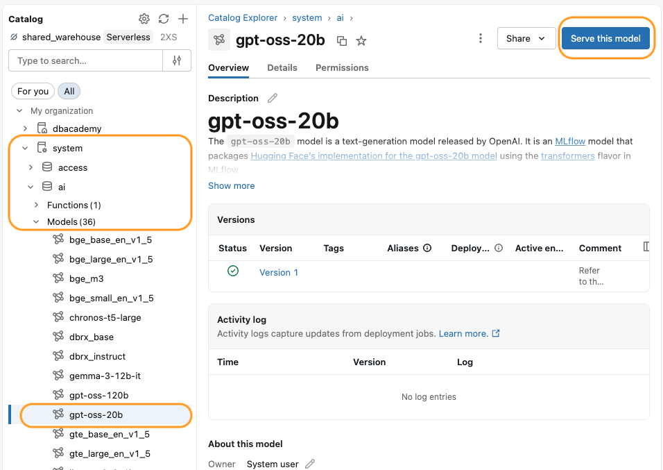
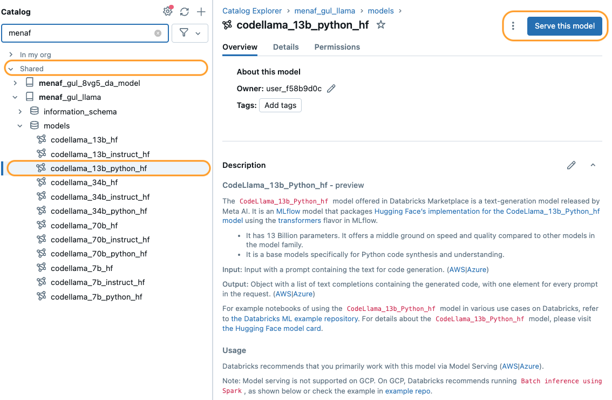

<div style="text-align: center; line-height: 0; padding-top: 9px;">
  
</div>

# Serving Models with Provisioned Throughput

**In this demo, we will focus on deploying GenAI applications using provisioned throughput.**

Deployment is a key part of operationalizing our LLM-based applications. We will explore deployment options within Databricks and demonstrate how to achieve production-ready model serving.

## Why Provisioned Throughput?

Provisioned throughput deployments are essential for production environments because they provide:

* **Throughput Guarantees:** Ensure consistent, predictable performance with dedicated compute resources that meet your application's SLA requirements.
* **Compliance Requirements:** Maintain data isolation and security controls required for regulated industries and enterprise governance policies.
* **Production Reliability:** Eliminate cold starts and resource contention, delivering stable response times even under variable load conditions.
* **Cost Predictability:** Fixed capacity pricing enables accurate budget forecasting for production workloads.

## Demo Overview

In this demo, we will walk through deploying models with provisioned throughput in Databricks. We'll discuss this in the following steps:

1. Access models in the **`system.ai` catalog**.
1. **Deploy the `gpt-oss-20b` model** to a Databricks Model Serving endpoint with provisioned throughput.
1. Query and validate the deployed model.

## Deploy a Model with Provisioned Throughput

While we have described and used tools like the AI Playground and Foundation Model APIs for querying common LLMs, production applications often require dedicated compute resources with guaranteed throughput and performance SLAs.

To achieve this, we use **Databricks Model Serving with Provisioned Throughput**. This deployment option provides dedicated infrastructure that ensures consistent performance, meets compliance requirements, and delivers predictable costs for production workloads.

### Getting a Model from `system.ai` Catalog

The Databricks **`system.ai` catalog** is part of the Databricks GenAI and Unity Catalog offerings. It is a curated list of state-of-the-art open source models managed in Unity Catalog. These models can be easily deployed using Model Serving with provisioned throughput or fine-tuned with Model Training.

For this demo, we will show how to deploy the **`gpt-oss-20b`** model.

To view and access the model:

1. From the left panel select **Catalog**.
1. Select **system** catalog.
1. Select **ai** schema. This will show a list of available models that you can serve.
1. Locate the **`gpt-oss-20b`** model in the list.



**Note:** Models in the `system.ai` catalog are governed by Unity Catalog, ensuring secure access control and compliance with your organization's data governance policies.



### Deploying a Model with Provisioned Throughput

Once we've located the `gpt-oss-20b` model in the `system.ai` catalog, we can deploy it by following these steps:

1. Navigate to the **`system.ai.gpt_oss_20b`** model page in the Catalog.
1. Click the **Serve this Model** button.
1. Configure the served entity:
    * Name: `gpt_oss_20b_endpoint`.
    * For served entities, select the `gpt-oss-20b` model.
1. Click the **Confirm** button.
1. Configure the Model Serving endpoint with **Provisioned Throughput**:
    * Select **Provisioned Throughput** as the compute type.
    * Choose the appropriate workload size based on your throughput requirements (e.g., Small, Medium, Large).
    * Configure scaling parameters to meet your SLA requirements.
    * Review security and access control settings.

**🚨 Notice: We won't deploy the model due to associated cost. In real use cases, we would click the Create button to provision the endpoint.**

**Note:** Provisioned throughput deployments typically take 10-15 minutes to initialize as dedicated compute resources are allocated for your endpoint.

## Query the Deployed Model

### Option 1 - Query via the UI

We can query the model directly in Databricks to confirm everything is working using the **Query endpoint** capability.

Sample query:
`{"messages": [{"role": "user", "content": "What are the key benefits of using Databricks for data engineering?"}]}`

### Option 2 - Query the Deployed Model in AI Playground

To test the model with AI Playground, select the deployed `gpt_oss_20b_endpoint` model and use the chatbox to send queries.

### Option 3 - Query the Deployed Model with the SDK

```python
from databricks.sdk import WorkspaceClient

w = WorkspaceClient()

# Sample messages to send to the model
messages = [
    {"role": "system", "content": "You are a helpful assistant."},
    {"role": "user", "content": "Explain the benefits of using provisioned throughput for production ML deployments."}
]

response = w.serving_endpoints.query(
    name="gpt_oss_20b_endpoint",  # name of the model serving endpoint
    messages=messages,
    max_tokens=200,
    temperature=0.7
)

print(response.choices[0].message.content)
```

**💡 Tip:** Adjust `max_tokens` and `temperature` parameters to control response length and creativity. With provisioned throughput, you'll experience consistent response times regardless of concurrent request volume.

---

&copy; 2026 Databricks, Inc. All rights reserved. Apache, Apache Spark, Spark, the Spark Logo, Apache Iceberg, Iceberg, and the Apache Iceberg logo are trademarks of the <a href="https://www.apache.org/" target="_blank">Apache Software Foundation</a>.<br/><br/><a href="https://databricks.com/privacy-policy" target="_blank">Privacy Policy</a> | <a href="https://databricks.com/terms-of-use" target="_blank">Terms of Use</a> | <a href="https://help.databricks.com/" target="_blank">Support</a>
