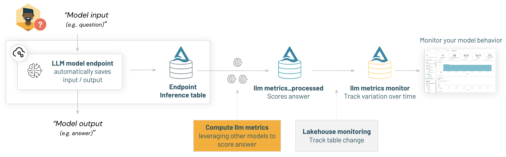
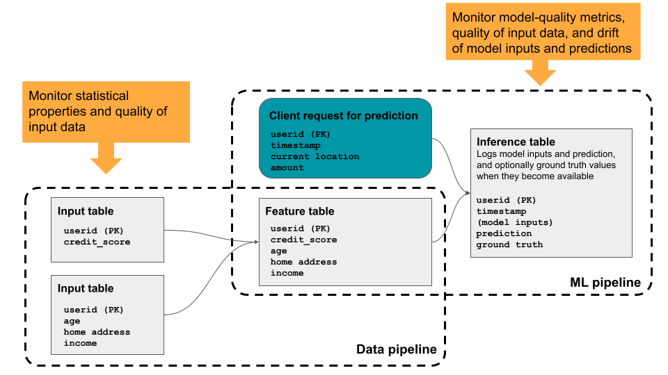
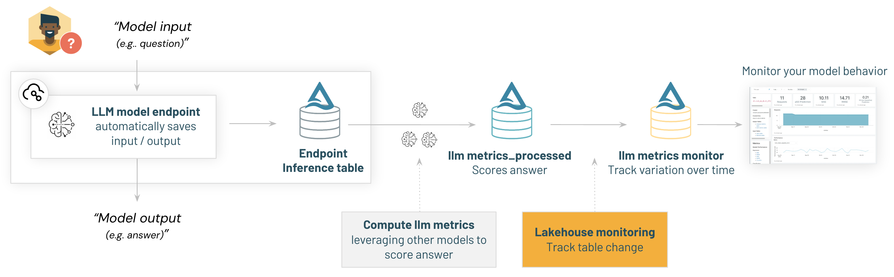
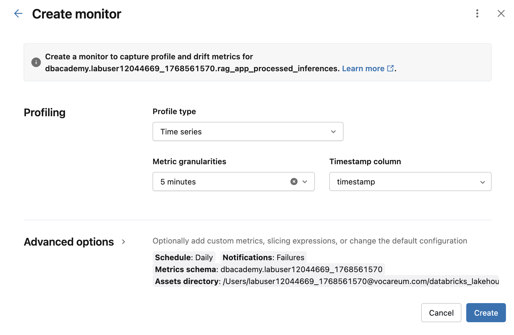
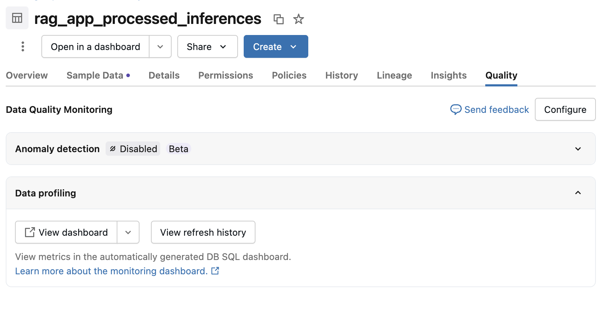
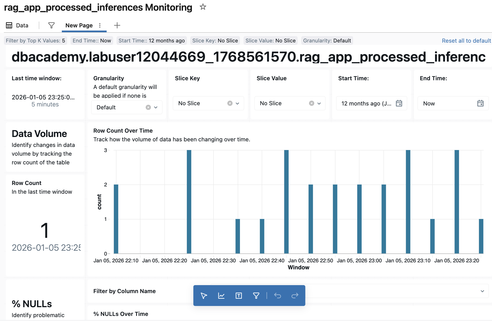

<div style="text-align: center; line-height: 0; padding-top: 9px;">
  
</div>

# Online Monitoring an LLM RAG Chain

**In this demo, we will lay the foundation for monitoring our GenAI applications using Lakehouse Monitoring.** Lakehouse Monitoring is an automated data monitoring solution provided by Databricks. We are going to use it to monitor the input/output data of GenAI applications.

## Demo Overview

To complete this demo, we'll follow the below steps:

1. Unpack the Inference Table for an existing Model Serving Endpoint.
2. Compute some LLM metrics.
3. Describe the basics of using Lakehouse Monitoring.
4. Set up a more robust monitor using Lakehouse Monitoring

## Step 1: Create Inference Table

To demonstrate monitoring, we will create a pre-populated sample inference table.

```python
from delta.tables import DeltaTable

inference_table_name = f"{DA.catalog_name}.{DA.schema_name}.rag_app_realtime_payload"

# Check whether the table exists before proceeding.
inference_table_exists = DeltaTable.forName(spark, inference_table_name)

if inference_table_exists:
    display(spark.sql(f"SELECT * FROM {inference_table_name} LIMIT 5"))
else:
    raise Exception("Inference table does not exist, please re-run/verify classroom setup script")
```

## Step 2: Unpack the Inference Table and Compute LLM Metrics



### 2.1: Unpacking the table

The request and response columns contains model prompts and output as a `string`.

We will use Spark JSON Path annotation to directly access the prompt and completions as string, concatenate them together with an `array_zip` and finally `explode` the content to have single prompt/completions rows.

```python
# The format of the input payloads, following the TF "inputs" serving format with a "query" field.
# Single query input format: {"inputs": [{"query": "User question?"}]}
INPUT_REQUEST_JSON_PATH = "inputs[*].query"

# Matches the schema returned by the JSON selector (inputs[*].query is an array of string)
INPUT_JSON_PATH_TYPE = "array<string>"
KEEP_LAST_QUESTION_ONLY = False

# Answer format: {"predictions": ["answer"]}
OUTPUT_REQUEST_JSON_PATH = "predictions"

# Matches the schema returned by the JSON selector (predictions is an array of string)
OUPUT_JSON_PATH_TYPE = "array<string>"
```

Test the unpacking logic on a sample in batch mode:

```python
# Unpack using provided helper function
payloads_sample_df = spark.table(inference_table_name).where('status_code == 200').limit(10)
payloads_unpacked_sample_df = unpack_requests(
    payloads_sample_df,
    INPUT_REQUEST_JSON_PATH,
    INPUT_JSON_PATH_TYPE,
    OUTPUT_REQUEST_JSON_PATH,
    OUPUT_JSON_PATH_TYPE,
    KEEP_LAST_QUESTION_ONLY
)

display(payloads_unpacked_sample_df)
```

### 2.2: Compute [Prompt-Completion] Evaluation Metrics

Compute text evaluation metrics such as toxicity, perplexity and readability:

```python
import tiktoken, textstat, evaluate
import pandas as pd
from pyspark.sql.functions import pandas_udf


@pandas_udf("int")
def compute_num_tokens(texts: pd.Series) -> pd.Series:
  encoding = tiktoken.get_encoding("cl100k_base")
  return pd.Series(map(len, encoding.encode_batch(texts)))

@pandas_udf("double")
def flesch_kincaid_grade(texts: pd.Series) -> pd.Series:
  return pd.Series([textstat.flesch_kincaid_grade(text) for text in texts])
 
@pandas_udf("double")
def automated_readability_index(texts: pd.Series) -> pd.Series:
  return pd.Series([textstat.automated_readability_index(text) for text in texts])

@pandas_udf("double")
def compute_toxicity(texts: pd.Series) -> pd.Series:
  # Omit entries with null input from evaluation
  toxicity = evaluate.load("toxicity", module_type="measurement", cache_dir="/tmp/hf_cache/")
  return pd.Series(toxicity.compute(predictions=texts.fillna(""))["toxicity"]).where(texts.notna(), None)

@pandas_udf("double")
def compute_perplexity(texts: pd.Series) -> pd.Series:
  # Omit entries with null input from evaluation
  perplexity = evaluate.load("perplexity", module_type="measurement", cache_dir="/tmp/hf_cache/")
  return pd.Series(perplexity.compute(data=texts.fillna(""), model_id="gpt2")["perplexities"]).where(texts.notna(), None)
```

```python
from pyspark.sql import DataFrame
from pyspark.sql.functions import col

def compute_metrics(requests_df: DataFrame, column_to_measure = ["input", "output"]) -> DataFrame:
  for column_name in column_to_measure:
    requests_df = (
      requests_df.withColumn(f"toxicity({column_name})", compute_toxicity(col(column_name)))
                 .withColumn(f"perplexity({column_name})", compute_perplexity(col(column_name)))
                 .withColumn(f"token_count({column_name})", compute_num_tokens(col(column_name)))
                 .withColumn(f"flesch_kincaid_grade({column_name})", flesch_kincaid_grade(col(column_name)))
                 .withColumn(f"automated_readability_index({column_name})", automated_readability_index(col(column_name)))
    )
  return requests_df
```

### 2.3: Incrementally unpack & compute metrics from payloads and save to final `_processed` table

Steps:
1. Read `inference_table_name` delta table as stream and unpack payloads
2. Drop unnecessary columns from streaming dataframe
3. Calculate LLM-related evaluation metrics
4. Initialize the `processed_table` with Delta's Change-Data-Feed and column mapping enabled
5. Append new processed payloads and metrics to `processed_table_name` delta table

```python
import os

# Reset checkpoint [for demo purposes ONLY]
checkpoint_location = os.path.join(DA.paths.working_dir, "checkpoint")
dbutils.fs.rm(checkpoint_location, True)

# Unpack the requests as a stream.
requests_raw_df = spark.readStream.table(inference_table_name)
requests_processed_df = unpack_requests(
    requests_raw_df,
    INPUT_REQUEST_JSON_PATH,
    INPUT_JSON_PATH_TYPE,
    OUTPUT_REQUEST_JSON_PATH,
    OUPUT_JSON_PATH_TYPE,
    KEEP_LAST_QUESTION_ONLY
)

# Drop un-necessary columns for monitoring jobs
requests_processed_df = requests_processed_df.drop("date", "status_code", "sampling_fraction", "client_request_id", "databricks_request_id")

# Compute text evaluation metrics
requests_with_metrics_df = compute_metrics(requests_processed_df)
```

```python
def create_processed_table_if_not_exists(table_name, requests_with_metrics):
    """
    Helper method to create processed table using schema
    """
    (
      DeltaTable.createOrReplace(spark)
        .tableName(table_name)
        .addColumns(requests_with_metrics.schema)
        .property("delta.enableChangeDataFeed", "true")
        .property("delta.columnMapping.mode", "name")
        .execute()
    )
```

```python
# Persist the requests stream, with a defined checkpoint path for this table
processed_table_name = f"{DA.catalog_name}.{DA.schema_name}.rag_app_processed_inferences"
create_processed_table_if_not_exists(processed_table_name, requests_with_metrics_df)

# Append new unpacked payloads & metrics
(requests_with_metrics_df.writeStream
                      .trigger(availableNow=True)
                      .format("delta")
                      .outputMode("append")
                      .option("checkpointLocation", checkpoint_location)
                      .toTable(processed_table_name).awaitTermination())

# Display the table (with requests and text evaluation metrics) that will be monitored.
display(spark.table(processed_table_name))
```

## Step 3: Describe the Basics of Lakehouse Monitoring

Databricks Lakehouse Monitoring lets you monitor the *statistical properties* and *quality* of all data. This includes the data associated with classical ML and GenAI models and model-serving endpoints.

Applications of Lakehouse Monitoring for GenAI:

* Monitor the statistical properties of the data used in the table associated with a Vector Search index
* Monitor the relative performance of different entities over time
* Monitor unstructured/text-related metrics of prompt/completions of Model Serving endpoints

### How Lakehouse Monitoring Works

Lakehouse Monitoring is focused on the **data** associated with your application – Delta tables in Unity Catalog.

To monitor a table, you create a **monitor** attached to the table.



In the above visual, the flow of data is:

1. Data starts in an **input table**
2. Data is processed through an ML pipeline
3. Data is written to an **inference table**

Lakehouse Monitoring is designed to monitor the **input table** and the **inference table**.

### Types of Monitors

| **Type** | **Description** |
|------| ------------|
| Time series | Use for tables that contain a time series dataset based on a timestamp column. Monitoring computes data quality metrics across time-based windows of the time series.|
| InferenceLog   | Use for tables that contain the request log for a model. Each row is a request, with columns for the timestamp, the model inputs, the corresponding prediction, and (optional) ground-truth label.|
| Snapshot    | Use for all other types of tables. Monitoring calculates data quality metrics over all data in the table. The complete table is processed with every refresh.|

### Lakehouse Monitoring Output

When a monitor is set up, Lakehouse Monitoring will automatically generate:

1. Two **metrics tables** — Delta tables containing profiling and drift measurements
2. A **dashboard** to visualize the calculated metrics
3. **SQL alerts** can be manually created to alert stakeholders of certain data characteristics

## Step 4: Create a Monitor on the processed inference table



### 4.1: (Optional) Using the UI

To set up this monitor via UI:

1. Navigate to the **Catalog**
2. Find the table that we want to monitor
3. Click the **Quality** tab.
4. Click the **Enable** button.
5. Then click on **Configure** under **Data profiling**.
6. In Create monitor, choose the options we want to set up the monitor.



**Note:** We are going to set up a **Timeseries** profile here.

### 4.2: Using the databricks-sdk

```python
from databricks.sdk import WorkspaceClient
from databricks.sdk.service.catalog import MonitorTimeSeries

# Create monitor using databricks-sdk's `quality_monitors` client
w = WorkspaceClient()

try:
  lhm_monitor = w.quality_monitors.create(
    table_name=processed_table_name, # Always use 3-level namespace
    time_series = MonitorTimeSeries(
      timestamp_col = "timestamp",
      granularities = ["5 minutes"],
    ),
    assets_dir = os.getcwd(),
    slicing_exprs = ["model_id"],
    output_schema_name=f"{DA.catalog_name}.{DA.schema_name}"
  )

except Exception as lhm_exception:
  print(lhm_exception)
```

```python
from databricks.sdk.service.catalog import MonitorInfoStatus

monitor_info = w.quality_monitors.get(processed_table_name)
print(monitor_info.status)

if monitor_info.status == MonitorInfoStatus.MONITOR_STATUS_PENDING:
    print("Wait until monitor creation is completed...")
```

**⏰ Expected monitor creation & refresh time: 10-15 mins**

```python
monitor_info = w.quality_monitors.get(processed_table_name)
assert monitor_info.status == MonitorInfoStatus.MONITOR_STATUS_ACTIVE, "Monitoring is not ready yet. Check back in a few minutes or view the monitoring creation process for any errors."
```

### 4.3: Refresh Metrics Manually

You can run "refresh metrics" to manually refresh the metrics and Dashboards.

### 4.4: Review the Monitor and Data in the Catalog Explorer

Once the monitor is created, review the **Quality** tab in the original table's catalog view.



For our **Timeseries** example, the monitor creates two tables:

* `*_processed_profile_metrics`
* `*_processed_drift_metrics`

```python
display(spark.sql(f"SELECT * FROM {monitor_info.drift_metrics_table_name}"))
```

### Examine the Dashboard in Databricks SQL

Lakehouse Monitoring will generate Databricks SQL dashboards to review the data of a monitoring solution. The dashboard contains:

* Primary name
* Overall summary statistics
* Time range filters
* Time-based metrics on:
  * Table size
  * Numeric/categorical profiles
  * Data integrity
  * Drift



---

&copy; 2026 Databricks, Inc. All rights reserved. Apache, Apache Spark, Spark, the Spark Logo, Apache Iceberg, Iceberg, and the Apache Iceberg logo are trademarks of the <a href="https://www.apache.org/" target="_blank">Apache Software Foundation</a>.<br/><br/><a href="https://databricks.com/privacy-policy" target="_blank">Privacy Policy</a> | <a href="https://databricks.com/terms-of-use" target="_blank">Terms of Use</a> | <a href="https://help.databricks.com/" target="_blank">Support</a>
